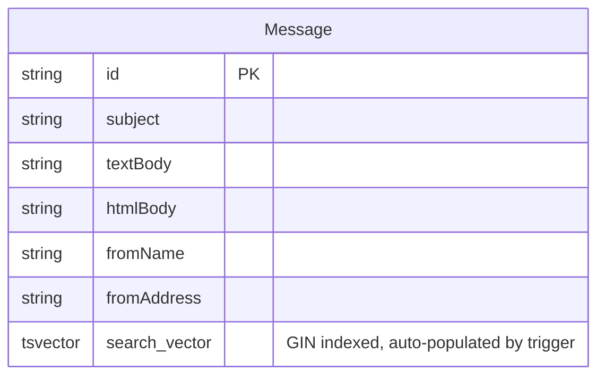

# feat: Add Message Search

## Overview

Add in-page search to each mail category (Imbox, Feed, Paper Trail, Archive, Sent). Users type a query in the page header, the URL updates with `?q=term`, and the message list filters in place using PostgreSQL full-text search. Results are ranked by relevance.

## Motivation

With 10k+ messages, users need a fast way to find specific emails by subject and body text. PostgreSQL's native FTS with a GIN index provides sub-second search without adding infrastructure.

## Pre-work: Fix basePath on Feed, Paper Trail, Sent

**Files to modify:**

- `src/app/(mail)/feed/page.tsx` — add `basePath="/feed"`
- `src/app/(mail)/paper-trail/page.tsx` — add `basePath="/paper-trail"`
- `src/app/(mail)/sent/page.tsx` — add `basePath="/sent"`

These pages currently omit `basePath` on `<MessageList>`, defaulting to `/imbox`. Clicking a message navigates to the wrong URL. This is a pre-existing bug — fix it in a separate commit before starting search work.

---

## Proposed Solution

### Architecture: Server Component + URL Search Params

Each page's server component reads `searchParams.q`. When present, it queries via `$queryRaw` using `websearch_to_tsquery`. When absent, the existing Prisma query runs unchanged. A client-side search input component manages debounce and URL updates.

This reuses all existing page infrastructure — no new API routes, no client-side data fetching for results.

### Data flow

```
[SearchInput (client)] --debounce 300ms--> router.replace("?q=term")
                                              |
                                    [Next.js re-renders page]
                                              |
                              [Server component reads searchParams.q]
                                              |
                                  [searchMessages() via $queryRaw]
                                              |
                                  [<MessageList messages={results} />]
```

## Technical Approach

### Phase 1: Database — tsvector column, GIN index, trigger

**Files:**

- New: `prisma/migrations/search_vector.sql`

Add a `search_vector tsvector` column to the `Message` table with a GIN index and an auto-update trigger. This keeps search vector maintenance in the database layer — no application code needed for population.

```sql
-- 1. Add column
ALTER TABLE "Message" ADD COLUMN IF NOT EXISTS "search_vector" tsvector;

-- 2. Create GIN index
CREATE INDEX IF NOT EXISTS "Message_search_vector_idx"
  ON "Message" USING GIN ("search_vector");

-- 3. Trigger function to auto-compute on INSERT/UPDATE
CREATE OR REPLACE FUNCTION message_search_vector_update() RETURNS trigger AS $$
BEGIN
  NEW.search_vector :=
    setweight(to_tsvector('english', COALESCE(NEW.subject, '')), 'A') ||
    setweight(to_tsvector('english', COALESCE(NEW."fromName", '')), 'B') ||
    setweight(to_tsvector('english',
      CASE
        WHEN NEW."textBody" IS NOT NULL AND NEW."textBody" != ''
          THEN NEW."textBody"
        WHEN NEW."htmlBody" IS NOT NULL
          THEN regexp_replace(NEW."htmlBody", '<[^>]+>', ' ', 'g')
        ELSE ''
      END
    ), 'C');
  RETURN NEW;
END
$$ LANGUAGE plpgsql;

CREATE TRIGGER message_search_vector_trigger
  BEFORE INSERT OR UPDATE OF subject, "textBody", "htmlBody", "fromName"
  ON "Message"
  FOR EACH ROW
  EXECUTE FUNCTION message_search_vector_update();

-- 4. Backfill existing messages (batched for safety on large tables)
-- Run repeatedly until 0 rows affected:
UPDATE "Message" SET "search_vector" =
  setweight(to_tsvector('english', COALESCE(subject, '')), 'A') ||
  setweight(to_tsvector('english', COALESCE("fromName", '')), 'B') ||
  setweight(to_tsvector('english',
    CASE
      WHEN "textBody" IS NOT NULL AND "textBody" != ''
        THEN "textBody"
      WHEN "htmlBody" IS NOT NULL
        THEN regexp_replace("htmlBody", '<[^>]+>', ' ', 'g')
      ELSE ''
    END
  ), 'C')
WHERE id IN (
  SELECT id FROM "Message" WHERE "search_vector" IS NULL LIMIT 1000
);
```

**Weight hierarchy:** Subject (A) > Sender name (B) > Body text (C)

**Note:** `fromAddress` is excluded from the tsvector — FTS tokenizes email addresses poorly. If exact-address search is needed later, a separate `ILIKE` clause would be more reliable.

**Note:** The HTML stripping regex removes tags but leaves content from `<style>` and `<script>` blocks. This is a known limitation — acceptable for FTS where occasional false positives are tolerable.

**Why a trigger:** The project uses `prisma db push` and Prisma's `message.create()` — it cannot set a `tsvector` column. A trigger handles this transparently. No changes to `processMessage` needed.

**Migration strategy:** Since the project uses `db push` (no Prisma migrations), run this SQL file manually:

```bash
docker compose exec -T postgres psql -U kurir < prisma/migrations/search_vector.sql
```

The column is invisible to Prisma schema and only accessed via `$queryRaw`.

---

### Phase 2: Search function + search input component

**Files:**

- New: `src/lib/mail/search.ts`
- New: `src/components/mail/search-input.tsx`

#### Search query function

A shared function that executes the FTS query. Each caller passes its own category filter as a `Prisma.Sql` fragment — no abstraction over category names needed.

```typescript
// src/lib/mail/search.ts
import { db } from "@/lib/db";
import { Prisma } from "@prisma/client";

interface MessageSearchResult {
  id: string;
  subject: string | null;
  snippet: string | null;
  fromAddress: string;
  fromName: string | null;
  receivedAt: Date;
  isRead: boolean;
  hasAttachments: boolean;
}

export async function searchMessages(
  userId: string,
  query: string,
  categoryFilter: Prisma.Sql,
  limit = 50,
) {
  return db.$queryRaw<MessageSearchResult[]>(Prisma.sql`
    SELECT
      id, subject, snippet, "fromAddress", "fromName",
      "receivedAt", "isRead", "hasAttachments"
    FROM "Message"
    WHERE "userId" = ${userId}
      AND "search_vector" @@ websearch_to_tsquery('english', ${query})
      ${categoryFilter}
    ORDER BY
      ts_rank("search_vector", websearch_to_tsquery('english', ${query})) DESC,
      "receivedAt" DESC
    LIMIT ${limit}
  `);
}
```

**Key decisions:**

- Uses `websearch_to_tsquery` — handles user input safely (supports quotes, `-` exclusion, no syntax errors on special chars)
- Sorts by relevance first, then recency as tiebreaker
- **No `Prisma.raw()`** — each page passes a safe `Prisma.sql` fragment for its category filter
- **No sender JOIN** — `MessageList` already falls back to `fromName`/`fromAddress` when `sender` is null. Search results use these directly, avoiding a JOIN and keeping the query simple.
- **No thread collapsing** during search — shows individual matching messages so users see exactly why each result appeared
- `MessageSearchResult` is explicitly typed to match the `Message` interface in `message-list.tsx` (minus `sender` and `threadCount` which are optional)

#### Search input component

A client component for the page header. Debounces input and updates the URL.

```
Behavior:
- Reads initial value from URL ?q= param (useSearchParams)
- On input change: debounce 300ms → router.replace(pathname + "?q=" + value)
- On clear (X button or Escape key): router.replace(pathname) — removes ?q=
- Minimum 2 characters before firing search
- Shows a Search icon (lucide-react) and clear button
- Simple input at all breakpoints (no collapse/expand on mobile for v1)
```

Uses `useSearchParams`, `usePathname`, and `useRouter` from `next/navigation`.

---

### Phase 3: Page integration

**Files to modify:**

- `src/app/(mail)/imbox/page.tsx`
- `src/app/(mail)/feed/page.tsx`
- `src/app/(mail)/paper-trail/page.tsx`
- `src/app/(mail)/archive/page.tsx`
- `src/app/(mail)/sent/page.tsx`

Each page:

1. Accepts `searchParams` prop (Next.js 15 async server component pattern)
2. When `searchParams.q` is present and >= 2 chars: calls `searchMessages()` with its specific category filter
3. When searching: skips `collapseToThreads()` and the Imbox read/unread split
4. Passes results to `<MessageList>` as before

**Pattern for each page (Imbox example):**

```tsx
import { searchMessages } from "@/lib/mail/search";
import { Prisma } from "@prisma/client";

export default async function ImboxPage({
  searchParams,
}: {
  searchParams: Promise<{ q?: string }>;
}) {
  const session = await auth();
  if (!session?.user?.id) redirect("/login");

  const { q } = await searchParams;
  const isSearching = q && q.length >= 2;

  const messages = isSearching
    ? await searchMessages(
        session.user.id,
        q,
        Prisma.sql`AND "isInImbox" = true`,
      )
    : await getImboxMessages(session.user.id);

  return (
    <div className="flex h-full flex-col">
      <div className="flex h-16 items-center justify-between border-b pl-14 pr-4 md:px-6">
        <h1 className="text-xl font-semibold md:text-2xl">Imbox</h1>
        <SearchInput />
      </div>
      {/* When searching: single flat list, no "New For You" / "Previously Seen" split */}
      {/* When not searching: normal Imbox layout */}
    </div>
  );
}
```

**Sent page differs** — must look up the sent folder first, then pass folder-based filter:

```tsx
const sentFolder = await db.folder.findFirst({ where: { userId, OR: [...] } });
const messages = isSearching
  ? await searchMessages(userId, q, Prisma.sql`AND "folderId" = ${sentFolder!.id}`)
  : await getSentMessages(userId);
```

---

## Acceptance Criteria

- [x] `search_vector` tsvector column exists on Message with GIN index and auto-update trigger
- [x] Existing messages are backfilled with search vectors
- [x] Search input appears in the header of Imbox, Feed, Paper Trail, Archive, Sent pages
- [x] Typing a query (>= 2 chars) updates URL to `?q=term` after 300ms debounce
- [x] Message list filters to show matching results ranked by relevance
- [x] Clearing search restores the normal message list and removes `?q=` from URL
- [x] Direct navigation to `?q=term` URL shows search results with input pre-populated
- [x] Browser back/forward navigates through search states correctly
- [x] Search input is usable on mobile
- [x] Sent page search works (folder-based filter, not boolean)
- [x] Imbox search shows flat results (no "New For You" / "Previously Seen" split)
- [x] Search skips thread collapsing — shows individual matching messages
- [x] Special characters in queries don't cause errors (websearch_to_tsquery handles this)
- [x] Feed, Paper Trail, Sent pages have correct `basePath` on MessageList (pre-work)

## Dependencies & Risks

**Dependencies:**

- PostgreSQL 11+ required for `websearch_to_tsquery` (should already be the case)
- Raw SQL migration must be run before the feature works

**Risks:**

- `prisma db push` could interfere with the manually-added `search_vector` column. Mitigation: Prisma ignores columns not in the schema — `db push` will not drop unknown columns by default (only `--force-reset` would).
- Backfill on very large tables may be slow. Mitigation: batched UPDATE (1000 rows at a time) in the migration SQL.
- Each debounced keystroke triggers a server component re-render (network round-trip). With sub-second FTS queries and 300ms debounce, this should be imperceptible on normal connections.

## ERD Changes



## References

- Brainstorm: `docs/brainstorms/2026-02-16-message-search-brainstorm.md`
- Existing search pattern: `src/app/api/contacts/search/route.ts`
- Message model: `prisma/schema.prisma` (lines 147-221)
- Page header pattern: `src/app/(mail)/imbox/page.tsx` (line 51)
- MessageList interface: `src/components/mail/message-list.tsx`
- processMessage (no changes needed thanks to trigger): `src/lib/mail/sync-service.ts` (line 393)
- PostgreSQL FTS docs: https://www.postgresql.org/docs/current/textsearch.html
