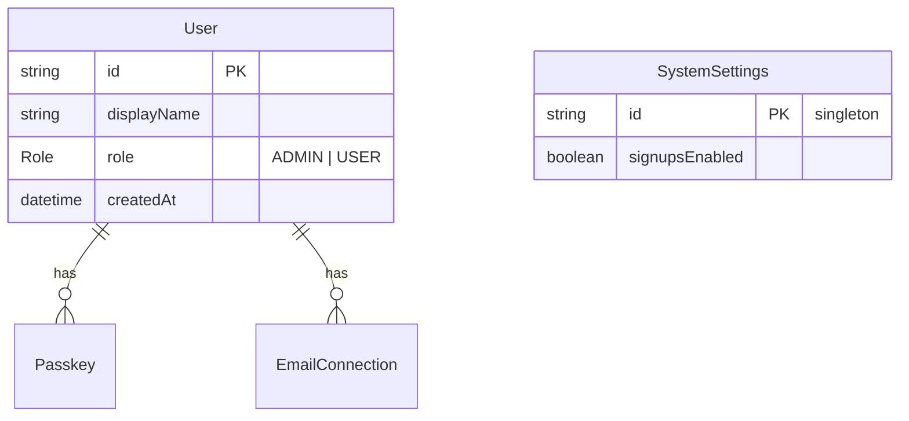

# Admin Roles & Signup Settings

## Enhancement Summary

**Deepened on:** 2026-03-17
**Agents used:** architecture-strategist, security-sentinel, kieran-typescript-reviewer, data-integrity-guardian, code-simplicity-reviewer, best-practices-researcher

### Key Improvements from Deepening

1. Use `Serializable` transaction isolation for first-user-gets-admin (prevents race condition)
2. Simplified from 3 client components to 1 (`admin-panel.tsx`)
3. Eliminated `/api/auth/signup-status` route — register page becomes server component wrapper
4. `requireAdmin()` helper with DB check for mutations (not JWT-only)
5. Role in JWT for UI convenience, DB verification for all mutations
6. Self-demotion protection and last-admin guard with proper isolation
7. Toggle button for role instead of dropdown (only 2 roles)

---

## Overview

Add an admin role system and instance-wide signup control. The first user to register becomes admin automatically. Admins can view all users, manage roles, and toggle whether new signups are allowed.

## Problem Statement / Motivation

Kurir currently has no role system — any visitor can register and create an account. For a self-hosted email client, the instance owner needs to control who can sign up and manage existing users. Without this, the app is open to anyone who discovers the URL.

## Proposed Solution

### 1. Schema Changes

Add a `Role` enum and `role` field to `User`, plus a `SystemSettings` singleton for instance-wide config.

```prisma
// prisma/schema.prisma

enum Role {
  ADMIN
  USER
}

model User {
  // ... existing fields ...
  role Role @default(USER)
}

model SystemSettings {
  id             String  @id @default("singleton")
  signupsEnabled Boolean @default(true)
}
```

**Why a `SystemSettings` model?** A dedicated table is simpler than environment variables (can be toggled at runtime without redeployment) and simpler than adding a column to User (which would only be meaningful on one user). The singleton pattern (`id = "singleton"`) with `upsert` access prevents multi-row issues.

**Migration safety:** Adding a `role` field with `@default(USER)` is purely additive. PostgreSQL 11+ handles `ALTER TABLE ... ADD COLUMN ... DEFAULT` as a metadata-only operation (instant, no table rewrite). Existing users get `role = USER` automatically. The `Role` enum type is created as `CREATE TYPE "Role" AS ENUM ('ADMIN', 'USER')`.

### 2. First User Gets Admin

In the WebAuthn registration verify route (`src/app/api/auth/webauthn/register/verify/route.ts`), use `Serializable` isolation to prevent a race condition where two simultaneous registrations both see `count = 0`:

```typescript
const user = await db.$transaction(
  async (tx) => {
    const userCount = await tx.user.count();
    const role = userCount === 0 ? "ADMIN" : "USER";

    const newUser = await tx.user.create({
      data: {
        role,
        passkeys: {
          create: {
            /* ... existing passkey data ... */
          },
        },
      },
    });

    // Ensure SystemSettings singleton exists
    await tx.systemSettings.upsert({
      where: { id: "singleton" },
      create: {},
      update: {},
    });

    return newUser;
  },
  {
    isolationLevel: "Serializable",
  },
);
```

**Why Serializable?** Under PostgreSQL's default `READ COMMITTED`, two concurrent transactions can both read `count = 0` before either commits. `Serializable` causes one to fail with a serialization error (Prisma `P2034`). For a self-hosted app where registration is rare, this is a theoretical concern but trivially prevented.

Also check `signupsEnabled` inside the same transaction (see section 3).

### 3. Block Registration When Signups Disabled

Check inside the transaction, before creating the user (skip for `addPasskey=true`):

```typescript
// Inside the Serializable transaction, before user.create:
const settings = await tx.systemSettings.findUnique({
  where: { id: "singleton" },
});
// If no settings row exists (first user), allow registration
if (settings && !settings.signupsEnabled) {
  throw new Error("SIGNUPS_DISABLED");
}
```

Catch the error outside the transaction and return a 403 response.

**Register page:** Convert to a server component wrapper that checks the DB directly (no API route needed):

```tsx
// src/app/(auth)/register/page.tsx
export default async function RegisterPage() {
  const settings = await db.systemSettings.findUnique({
    where: { id: "singleton" },
  });
  if (settings && !settings.signupsEnabled) {
    return <SignupsClosedMessage />;
  }
  return <RegisterForm />; // existing client component, extracted
}
```

This eliminates the need for a separate `/api/auth/signup-status` API route.

### 4. Add Role to JWT/Session

Role goes in the JWT for UI convenience (showing/hiding admin link without a DB query). But **all admin mutations verify role from DB** via `requireAdmin()`.

**auth.config.ts** (edge-safe — no Prisma import needed):

```typescript
async jwt({ token, user }) {
  if (user) {
    token.id = user.id;
    token.role = user.role;
  }
  return token;
},
async session({ session, token }) {
  if (session.user && token.id) {
    session.user.id = token.id as string;
    session.user.role = (token.role as string) ?? "USER"; // default for pre-migration tokens
  }
  return session;
},
```

**Manually-minted JWTs:** The verify routes mint JWTs directly via `encode()`. Role must be included there too:

```typescript
// In register/verify/route.ts:
const token = await encode({
  token: { id: user.id, role: user.role },
  secret,
  salt: cookieName,
  maxAge: 30 * 24 * 60 * 60,
});

// Also in login/verify/route.ts (authenticate flow):
const token = await encode({
  token: { id: user.id, role: user.role },
  // ...
});
```

**Type extensions** in `src/types/next-auth.d.ts`:

```typescript
declare module "next-auth" {
  interface User {
    role?: string;
  }
  interface Session {
    user: { id: string; role: string };
  }
}
declare module "next-auth/jwt" {
  interface JWT {
    id?: string;
    role?: string;
  }
}
```

Use `string` instead of importing `Role` from `@prisma/client` to keep `auth.config.ts` edge-safe (Prisma enum imports may pull in Node.js dependencies).

**Stale JWT handling:** The JWT role can become stale when an admin changes another user's role. This is acceptable because:

- UI uses JWT role (optimistic, may be stale briefly)
- All mutations use `requireAdmin()` which checks DB (always fresh)
- User can log out/in to refresh

### 5. Auth Helpers

Add `requireAuth()` and `requireAdmin()` to `src/lib/auth.ts`:

```typescript
/** Returns authenticated session or throws. */
export async function requireAuth() {
  const session = await auth();
  if (!session?.user?.id) throw new Error("Unauthorized");
  return session;
}

/** Returns authenticated admin session or throws. Verifies role from DB. */
export async function requireAdmin() {
  const session = await requireAuth();
  const user = await db.user.findUnique({
    where: { id: session.user.id },
    select: { role: true },
  });
  if (user?.role !== "ADMIN") throw new Error("Forbidden");
  return session;
}
```

`requireAdmin()` always checks the DB — never relies on JWT role alone. This prevents privilege escalation from stale tokens.

### 6. Server Actions

New file: `src/actions/admin.ts`

```typescript
"use server";
import { requireAdmin } from "@/lib/auth";
import { db } from "@/lib/db";
import { revalidatePath } from "next/cache";

export async function toggleSignups(enabled: boolean) {
  await requireAdmin();
  await db.systemSettings.upsert({
    where: { id: "singleton" },
    create: { signupsEnabled: enabled },
    update: { signupsEnabled: enabled },
  });
  revalidatePath("/settings/admin");
}

export async function updateUserRole(
  targetUserId: string,
  newRole: "ADMIN" | "USER",
) {
  const session = await requireAdmin();

  // Prevent self-demotion
  if (targetUserId === session.user.id && newRole !== "ADMIN") {
    throw new Error("Cannot demote yourself. Ask another admin.");
  }

  await db.$transaction(
    async (tx) => {
      if (newRole !== "ADMIN") {
        const adminCount = await tx.user.count({
          where: { role: "ADMIN", NOT: { id: targetUserId } },
        });
        if (adminCount < 1) {
          throw new Error("Cannot remove the last admin");
        }
      }
      await tx.user.update({
        where: { id: targetUserId },
        data: { role: newRole },
      });
    },
    {
      isolationLevel: "Serializable",
    },
  );

  revalidatePath("/settings/admin");
}
```

### 7. Admin Settings Page

**Server component:** `src/app/(mail)/settings/admin/page.tsx`

1. Calls `requireAdmin()` — redirects non-admins to `/settings`
2. Fetches all users with connection counts
3. Fetches `SystemSettings`
4. Passes data to a single client component

**Single client component:** `src/components/settings/admin-panel.tsx`

Contains:

- **Signup toggle** — `<Switch>` calling `toggleSignups()` server action
- **Users table** — display name, role badge, email connection count, created date
- **Role toggle button** — "Make admin" / "Remove admin" button per user (not a dropdown — only 2 roles)

No need for separate `signup-toggle.tsx`, `users-table.tsx`, or `role-select.tsx` — this is a small page.

### 8. Navigation

Add an "Admin" link on the settings page, visible only when `session.user.role === "ADMIN"` (from JWT — acceptable for UI gating):

```tsx
// In src/app/(mail)/settings/page.tsx, add near the top:
{
  session.user.role === "ADMIN" && (
    <Link href="/settings/admin">Admin settings</Link>
  );
}
```

Also check `signupsEnabled` in the register options route (`/api/auth/webauthn/register/options`) to fail early before generating WebAuthn challenge.

## Technical Considerations

- **Edge safety**: Role is a plain string in JWT — no Prisma import needed in `auth.config.ts`. Use `string` type, not `Role` enum, in NextAuth type declarations.
- **DB vs JWT for auth checks**: JWT role for UI decisions (showing admin link), DB check via `requireAdmin()` for all mutations. This follows the official Next.js and Auth.js recommended pattern.
- **Singleton access**: Always use `upsert` for `SystemSettings`, never `create` (prevents unique constraint errors on concurrent access).
- **Transaction isolation**: `Serializable` on first-user registration and role updates prevents race conditions.
- **Pre-migration tokens**: Default to `"USER"` when `token.role` is undefined (handles existing JWTs minted before this feature).
- **Middleware**: No middleware changes needed for admin routes. Admin authorization happens in the page server component via `requireAdmin()`. Middleware is for optimistic UX only, not security boundaries.

## Acceptance Criteria

- [x] `Role` enum (`ADMIN`, `USER`) added to Prisma schema with `@default(USER)`
- [x] `SystemSettings` model with `signupsEnabled` boolean (singleton pattern)
- [x] First registered user automatically gets `ADMIN` role (Serializable tx)
- [x] Role embedded in JWT tokens (both register and login verify routes)
- [x] `requireAuth()` and `requireAdmin()` helpers in `src/lib/auth.ts`
- [x] Registration blocked with clear message when signups disabled
- [x] Register page converted to server component wrapper (no API route)
- [x] Admin settings page at `/settings/admin` (admin-only, DB-verified)
- [x] Users table showing: name, role badge, email connections count, created date
- [x] Toggle to enable/disable new signups (Switch component)
- [x] Role toggle button per user ("Make admin" / "Remove admin")
- [x] Self-demotion prevention
- [x] Last-admin protection (Serializable tx)
- [x] Admin link visible in settings page only for admin users
- [x] NextAuth types extended with `role: string`
- [x] Register options route checks `signupsEnabled` early

## ERD



## Implementation Order

1. Schema changes (`prisma/schema.prisma`) + `pnpm db:push`
2. NextAuth type declarations (`src/types/next-auth.d.ts`)
3. Auth helpers: `requireAuth()` + `requireAdmin()` in `src/lib/auth.ts`
4. JWT/session callbacks (`auth.config.ts`) — add role with `"USER"` default
5. Registration verify route — Serializable tx, first-user admin, signup check, role in JWT
6. Login verify route — include role in JWT
7. Register options route — check `signupsEnabled` early
8. Register page — convert to server component wrapper with signup-closed state
9. Server actions (`src/actions/admin.ts`) — `toggleSignups` + `updateUserRole`
10. Admin settings page + `admin-panel.tsx` client component
11. Settings page — admin link (conditional on JWT role)
12. One-time migration for existing instance: `UPDATE "User" SET role = 'ADMIN' WHERE id = (SELECT id FROM "User" ORDER BY "createdAt" ASC LIMIT 1);`

## Files to Create/Modify

### New files

- `src/app/(mail)/settings/admin/page.tsx` — admin settings server component
- `src/components/settings/admin-panel.tsx` — single client component (toggle + users table)
- `src/actions/admin.ts` — admin server actions

### Modified files

- `prisma/schema.prisma` — Role enum, role field on User, SystemSettings model
- `src/types/next-auth.d.ts` — extend with role
- `src/lib/auth.config.ts` — role in JWT/session callbacks
- `src/lib/auth.ts` — add `requireAuth()`, `requireAdmin()`
- `src/app/api/auth/webauthn/register/verify/route.ts` — first-user logic, signup check, role in JWT
- `src/app/api/auth/webauthn/register/options/route.ts` — early signupsEnabled check
- `src/app/api/auth/webauthn/login/verify/route.ts` — role in JWT (authenticate flow)
- `src/app/(auth)/register/page.tsx` — server component wrapper for signup-closed state
- `src/app/(mail)/settings/page.tsx` — admin link

## References

- Registration verify: `src/app/api/auth/webauthn/register/verify/route.ts`
- Auth config: `src/lib/auth.config.ts`
- Auth helpers: `src/lib/auth.ts`
- Settings page: `src/app/(mail)/settings/page.tsx`
- Server actions pattern: `src/actions/senders.ts`
- Middleware: `src/middleware.ts`
- [Auth.js RBAC Guide](https://authjs.dev/guides/role-based-access-control)
- [Next.js Authentication Guide](https://nextjs.org/docs/app/building-your-application/authentication)
