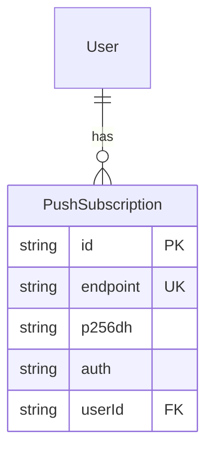

# Web Push Notifications for New Imbox Messages

## Enhancement Summary

**Deepened on:** 2026-03-17
**Research sources:** Context7 (web-push, Next.js PWA docs), SpecFlow analysis, security/performance/architecture/simplicity reviews, ICM learnings

### Key Improvements from Research
1. **Security headers** for `sw.js` via `next.config.ts` — `Cache-Control: no-cache`, CSP `default-src 'self'`
2. **`urgency: 'high'` and `topic`** options on web-push for email notifications
3. **Batched push sending** — collect all Imbox messages after IDLE loop, one `pushToUser()` call
4. **Simplified UX** — drop separate subscriptions GET endpoint, permanent banner dismiss, skip device name detection
5. **Endpoint validation** — Zod schema must enforce `https://` URLs
6. **`base64UrlToUint8Array`** utility needed client-side for VAPID key conversion

## Overview

Add Web Push notifications so users get alerted on their phone/desktop when new messages arrive in the Imbox — even when the browser tab is closed. Also add a PWA manifest (enabling iOS "Add to Home Screen"), a notification permission prompt with good discovery UX, and remove the snoozed badge from the sidebar.

## Problem Statement / Motivation

Currently, the only way to know about new Imbox messages is to have the app open in a browser tab. The IMAP IDLE → SSE pipeline provides realtime updates for active tabs, but there's no way to reach users who aren't currently looking at the app. This is especially painful on mobile where the browser tab may be in the background.

## Proposed Solution

Hook into the existing IMAP IDLE pipeline (`handleNewMessages()` in `idle-handlers.ts`) to send Web Push notifications via the `web-push` npm package when new Imbox messages arrive. Add a service worker for push event handling, a Prisma model for storing push subscriptions, and a clean UX for discovering and enabling the feature.

## Technical Approach

### Architecture

```
IMAP Server
    ↓ (IDLE "exists" event)
ConnectionManager → idle-handlers.ts → handleNewMessages()
    ↓                                        ↓
    ↓ (existing)                        (new) pushToUser()
    ↓                                        ↓
emitToUser() → SSE → browser tab      web-push → Push Service → sw.js → OS notification
```

The push notification path runs **alongside** the existing SSE path, not as a replacement. Both fire for every new Imbox message.

### Data Model

```prisma
model PushSubscription {
  id        String   @id @default(cuid())
  createdAt DateTime @default(now())

  // Web Push subscription data
  endpoint String   @unique  // Push service URL (always https://)
  p256dh   String   // Public key for payload encryption (base64url)
  auth     String   // Auth secret (base64url)

  // User relation
  userId String
  user   User   @relation(fields: [userId], references: [id], onDelete: Cascade)

  @@index([userId])
}
```



Add `pushSubscriptions PushSubscription[]` to the `User` model.

> **Simplification:** Dropped `deviceName` field. Not worth the complexity for 1-5 users. The settings UI just shows "This device" for the current subscription and a simple "Disable" for others.

### Implementation Phases

#### Phase 1: Infrastructure (Service Worker, PWA Manifest, Prisma Model)

**1a. Prisma model + migration** — `prisma/schema.prisma`

- Add `PushSubscription` model (see above)
- Add `pushSubscriptions PushSubscription[]` relation to `User`
- Run `pnpm db:push` then `pnpm db:generate`

**1b. Install `web-push` package**

```bash
pnpm add web-push
pnpm add -D @types/web-push
```

Add `"web-push"` to `serverExternalPackages` in `next.config.ts` — it uses Node.js `crypto` internally and should not be bundled.

**1c. VAPID key generation + environment variables**

- Generate keys: `npx web-push generate-vapid-keys`
- Add to `.env`:
  ```
  NEXT_PUBLIC_VAPID_PUBLIC_KEY=<generated>
  VAPID_PRIVATE_KEY=<generated>
  ```
- Add to `config/deploy.yml`:
  - Clear env: `NEXT_PUBLIC_VAPID_PUBLIC_KEY`
  - Secret env: `VAPID_PRIVATE_KEY`
- Add `KAMAL_VAPID_PRIVATE_KEY` to `.kamal/secrets`

> **VAPID key lifecycle:** Keys are generated once and must be preserved across deployments. If the private key is lost, all existing push subscriptions become invalid and users must re-subscribe. Back up keys alongside `ENCRYPTION_KEY`.

**1d. Service worker** — `public/sw.js`

Push-only service worker. **No fetch event listener** (critical — caching Next.js routes would break the app).

```js
// public/sw.js — push-only, no fetch caching
self.addEventListener("push", (event) => {
  const data = event.data?.json() ?? {};
  const title = data.title || "New message";
  const options = {
    body: data.body || "",
    icon: "/icon-192.png",
    badge: "/favicon.png",
    tag: data.tag, // threadId — collapses per-thread
    renotify: true, // vibrate again even if tag replaces existing notification
    data: { url: data.url || "/imbox" },
  };
  event.waitUntil(self.registration.showNotification(title, options));
});

self.addEventListener("notificationclick", (event) => {
  event.notification.close();
  const url = event.notification.data?.url || "/imbox";
  event.waitUntil(
    clients.matchAll({ type: "window", includeUncontrolled: true }).then((windowClients) => {
      // Focus existing tab if open
      for (const client of windowClients) {
        if (new URL(client.url).pathname === url && "focus" in client) {
          return client.focus();
        }
      }
      // Otherwise open new tab
      return clients.openWindow(url);
    })
  );
});
```

> **Research insight — `renotify: true`:** When using `tag` to collapse per-thread, the browser silently replaces the notification by default. Setting `renotify: true` ensures the user gets a vibration/sound alert for each new message in the thread.

> **Research insight — `includeUncontrolled: true`:** Ensures we find existing tabs even if they were opened before the service worker took control.

> **Research insight — URL comparison:** Use `new URL(client.url).pathname` for reliable path matching instead of `client.url.includes(url)` which could false-positive on substrings.

**1e. Security headers for service worker** — `next.config.ts`

Add headers configuration (from official Next.js PWA guide):

```ts
async headers() {
  return [
    {
      source: "/sw.js",
      headers: [
        { key: "Content-Type", value: "application/javascript; charset=utf-8" },
        { key: "Cache-Control", value: "no-cache, no-store, must-revalidate" },
        { key: "Content-Security-Policy", value: "default-src 'self'; script-src 'self'" },
      ],
    },
  ];
},
```

> **Why no-cache on sw.js:** Browsers check for updated service workers on navigation. If `sw.js` is cached, users won't get updated notification handling code after deployments. The browser's built-in byte-comparison still avoids unnecessary reinstalls.

**1f. PWA manifest** — `src/app/manifest.ts`

```ts
import type { MetadataRoute } from "next";

export default function manifest(): MetadataRoute.Manifest {
  return {
    name: "Kurir - Email for Humans",
    short_name: "Kurir",
    start_url: "/imbox",
    display: "standalone",
    background_color: "#ffffff",
    theme_color: "#171717",
    icons: [
      { src: "/icon-192.png", sizes: "192x192", type: "image/png" },
      { src: "/icon-512.png", sizes: "512x512", type: "image/png" },
    ],
  };
}
```

Next.js auto-links `manifest.ts` routes — no manual `<link>` tag needed.

**1g. Middleware matcher update** — `src/middleware.ts`

Update the matcher regex to exclude `sw.js`:

```ts
// Before:
matcher: ["/((?!_next/static|_next/image|favicon\\.ico|.*\\.png|.*\\.svg).*)"]

// After:
matcher: ["/((?!_next/static|_next/image|favicon\\.ico|sw\\.js|.*\\.png|.*\\.svg).*)"]
```

> **ICM learning confirmed:** This exact issue (middleware blocking static assets in `public/`) was previously encountered and documented. The service worker fetch request has no session cookie, so the middleware would redirect it to `/login`, causing registration to fail silently.

#### Phase 2: Subscribe/Unsubscribe API + Push Sender

**2a. Push subscribe/unsubscribe API** — `src/app/api/push/subscribe/route.ts`

```
POST /api/push/subscribe   — save subscription
DELETE /api/push/subscribe  — remove subscription
```

- Auth check: `const session = await auth(); if (!session?.user?.id) return NextResponse.json({ error: "Unauthorized" }, { status: 401 });`
- Zod validation:
  ```ts
  const schema = z.object({
    endpoint: z.string().url().startsWith("https://"),  // Must be HTTPS
    p256dh: z.string().min(1),
    auth: z.string().min(1),
  });
  ```
- Upsert on `endpoint` (re-subscribing from same browser updates existing record)
- DELETE takes `{ endpoint }` body, deletes matching record **scoped to authenticated userId**

> **Security:** Endpoint URLs MUST be `https://` — the Web Push protocol requires encrypted transport. Validating this prevents accidentally storing non-push URLs.

> **Simplification:** Dropped the separate `GET /api/push/subscriptions` endpoint. The settings component uses the `usePushNotifications` hook which already knows the current subscription state from the PushManager API. For a 1-5 user app, there's no need to list other devices.

**2b. Push notification sender** — `src/lib/mail/push-sender.ts`

```ts
import webpush from "web-push";
import { db } from "@/lib/db";

webpush.setVapidDetails(
  "mailto:admin@kurir.app",
  process.env.NEXT_PUBLIC_VAPID_PUBLIC_KEY!,
  process.env.VAPID_PRIVATE_KEY!,
);

interface PushPayload {
  title: string;
  body: string;
  url: string;
  tag?: string;
}

export async function pushToUser(userId: string, payload: PushPayload) {
  const subscriptions = await db.pushSubscription.findMany({
    where: { userId },
    select: { id: true, endpoint: true, p256dh: true, auth: true },
  });

  if (subscriptions.length === 0) return;

  const body = JSON.stringify(payload);
  const options = {
    TTL: 3600,         // 1 hour — email notifications stay relevant
    urgency: "high" as const,  // triggers immediate delivery + vibration
    topic: payload.tag,        // server-side notification collapsing per-thread
  };

  const results = await Promise.allSettled(
    subscriptions.map((sub) =>
      webpush.sendNotification(
        { endpoint: sub.endpoint, keys: { p256dh: sub.p256dh, auth: sub.auth } },
        body,
        options,
      ).catch(async (err) => {
        // Clean up expired/invalid subscriptions
        if (err.statusCode === 404 || err.statusCode === 410) {
          await db.pushSubscription.delete({ where: { id: sub.id } }).catch(() => {});
          console.log(`[push] Removed expired subscription ${sub.id}`);
        }
        throw err;
      })
    ),
  );

  const sent = results.filter((r) => r.status === "fulfilled").length;
  if (sent > 0) {
    console.log(`[push] Sent ${sent}/${subscriptions.length} notifications to user ${userId}`);
  }
}
```

> **Research insight — `urgency: 'high'`:** Tells the push service to deliver immediately and wake the device. Default `normal` may delay delivery to conserve battery. For an email client, `high` is appropriate.

> **Research insight — `topic`:** Server-side notification collapsing. If two messages arrive for the same thread, the push service replaces the first with the second (on top of the client-side `tag` collapsing in `sw.js`). This reduces notification spam during burst scenarios.

> **Research insight — `TTL: 3600`:** If the device is offline, the push service retains the notification for 1 hour. After that, it's dropped. Reasonable for email — if you're offline for an hour, you'll check manually.

**2c. Hook into IDLE handlers** — `src/lib/mail/idle-handlers.ts`

Modify `handleNewMessages()` to capture the return value of `processMessage()` and fire **batched** push notifications for Imbox messages:

```ts
// Inside handleNewMessages():
const newImboxMessages: Array<{ fromName: string | null; fromAddress: string; subject: string | null; threadId: string | null; id: string }> = [];

// In the for-await loop, capture processMessage return:
const message = await processMessage(msg, userId, connectionId, folderId, { isInbox: true, userEmails });
if (message) {
  count++;
  if (message.isInImbox) {
    newImboxMessages.push(message);
  }
}

// After the loop — SSE (existing) + push (new):
if (count > 0) {
  emitToUser(userId, { type: "new-messages", data: { folderId, count } });
}

// Batch push: send one notification per thread, fire-and-forget
if (newImboxMessages.length > 0) {
  // Dedupe by threadId — only latest message per thread
  const byThread = new Map<string, typeof newImboxMessages[0]>();
  for (const msg of newImboxMessages) {
    const key = msg.threadId || msg.id;
    byThread.set(key, msg); // last one wins
  }

  for (const msg of byThread.values()) {
    pushToUser(userId, {
      title: msg.fromName || msg.fromAddress,
      body: msg.subject || "(no subject)",
      url: `/imbox/${msg.threadId || msg.id}`,
      tag: msg.threadId || msg.id,
    }).catch((err) => console.error("[push] error:", err));
  }
}
```

> **Performance insight — thread dedup:** If 5 messages arrive in the same thread during one IDLE batch, the user gets 1 push notification (the latest), not 5. This combines with the 200ms IDLE debounce for good burst handling.

**Key decisions:**
- Use `threadId` as notification `tag` → collapses multiple replies in the same thread into one notification
- Fire-and-forget (`.catch()` on the promise) — push failures never block IDLE processing
- No suppression when SSE is active — SSE presence doesn't mean the user is looking at the tab
- Thread dedup before sending — one notification per thread per batch

#### Phase 3: Client-Side Registration + Discovery UX

**3a. Push registration hook** — `src/hooks/use-push-notifications.ts`

```ts
"use client";

import { useState, useEffect, useCallback } from "react";

// VAPID key must be Uint8Array for pushManager.subscribe()
function base64UrlToUint8Array(base64String: string): Uint8Array {
  const padding = "=".repeat((4 - (base64String.length % 4)) % 4);
  const base64 = (base64String + padding).replace(/-/g, "+").replace(/_/g, "/");
  const rawData = atob(base64);
  return Uint8Array.from(rawData, (char) => char.charCodeAt(0));
}

export function usePushNotifications() {
  const [permission, setPermission] = useState<NotificationPermission>("default");
  const [isSubscribed, setIsSubscribed] = useState(false);
  const [isSupported, setIsSupported] = useState(false);

  useEffect(() => {
    const supported = "serviceWorker" in navigator && "PushManager" in window;
    setIsSupported(supported);
    if (supported) {
      setPermission(Notification.permission);
      // Check existing subscription
      navigator.serviceWorker.ready.then((reg) =>
        reg.pushManager.getSubscription().then((sub) => setIsSubscribed(!!sub))
      );
    }
  }, []);

  const subscribe = useCallback(async () => {
    const reg = await navigator.serviceWorker.register("/sw.js");
    await navigator.serviceWorker.ready;

    const sub = await reg.pushManager.subscribe({
      userVisibleOnly: true,
      applicationServerKey: base64UrlToUint8Array(
        process.env.NEXT_PUBLIC_VAPID_PUBLIC_KEY!
      ),
    });

    const json = sub.toJSON();
    await fetch("/api/push/subscribe", {
      method: "POST",
      headers: { "Content-Type": "application/json" },
      body: JSON.stringify({
        endpoint: json.endpoint,
        p256dh: json.keys!.p256dh,
        auth: json.keys!.auth,
      }),
    });

    setPermission(Notification.permission);
    setIsSubscribed(true);
  }, []);

  const unsubscribe = useCallback(async () => {
    const reg = await navigator.serviceWorker.ready;
    const sub = await reg.pushManager.getSubscription();
    if (sub) {
      await fetch("/api/push/subscribe", {
        method: "DELETE",
        headers: { "Content-Type": "application/json" },
        body: JSON.stringify({ endpoint: sub.endpoint }),
      });
      await sub.unsubscribe();
    }
    setIsSubscribed(false);
  }, []);

  return { isSupported, permission, isSubscribed, subscribe, unsubscribe };
}
```

> **Research insight — `base64UrlToUint8Array`:** The Web Push API's `pushManager.subscribe()` requires the VAPID public key as a `Uint8Array`, but `web-push generate-vapid-keys` outputs base64url-encoded strings. This conversion utility is required on the client side.

> **Research insight — `userVisibleOnly: true`:** Required by all browsers. Tells the push service that every push event will show a visible notification (no silent pushes).

**3b. Discovery banner** — `src/components/mail/push-notification-banner.tsx`

A dismissible banner shown at the top of the Imbox page when:
- Push notifications are supported by the browser
- The user hasn't subscribed yet
- The user hasn't dismissed the banner (check `localStorage` key `kurir:push-banner-dismissed`)

```
┌─────────────────────────────────────────────────────────────┐
│ 🔔  Get notified when new emails arrive.  [Enable]  [✕]    │
└─────────────────────────────────────────────────────────────┘
```

- "Enable" triggers the permission prompt flow via the hook
- Dismiss permanently via `localStorage` (no 30-day re-show — keep it simple)
- On iOS non-PWA (detected via `navigator.standalone === undefined` on iOS UA), show: "Add Kurir to your Home Screen to enable notifications" with the Share icon instruction
- If `Notification.permission === "denied"`, show: "Notifications are blocked. Enable them in your browser settings."

Place in `src/app/(mail)/imbox/page.tsx` above the message list.

> **UX best practice — "pre-permission" pattern:** The banner acts as a soft ask before the browser's native permission dialog. Users who click "Enable" have already decided yes, so the browser prompt has high acceptance rate. Never trigger the browser prompt without user interaction.

**3c. Notification settings section** — `src/components/settings/notification-settings.tsx`

Add inline to the settings page (not a separate sub-page — too little content):
- Shows current status: "Enabled on this device" / "Not enabled"
- Enable/disable button using the hook
- If permission is `"denied"`, show instructions to unblock
- If on iOS non-PWA, show "Add to Home Screen" instructions

#### Phase 4: Sidebar Cleanup (Independent)

**4a. Remove snoozed badge** — `src/components/layout/navigation.ts`

Remove `badgeKey: "snoozed"` from the Snoozed nav item (line 25).

**4b. Clean up snoozed count** — Multiple files

- Remove `snoozedCount` prop from `Sidebar` and `MobileSidebar` interfaces
- Remove `getSnoozedCount` query from `(mail)/layout.tsx`
- Remove `snoozed` from `badgeCounts` object in both sidebar components
- Update `badgeKey` type union in `navigation.ts`: `"imbox" | "screener"` (remove `"snoozed"`)

## Acceptance Criteria

### Functional

- [ ] New Imbox messages trigger push notifications on subscribed devices
- [ ] Notifications show sender name as title, subject as body
- [ ] Clicking a notification opens the correct thread in the Imbox
- [ ] Multiple replies in the same thread collapse into one notification (via `tag` + thread dedup)
- [ ] Only Imbox messages generate push notifications (not Feed, Paper Trail, Screener)
- [ ] Users can subscribe/unsubscribe from push notifications
- [ ] Users can manage notifications in Settings
- [ ] Discovery banner appears in Imbox for users who haven't enabled notifications
- [ ] Banner can be permanently dismissed (localStorage)
- [ ] iOS users see "Add to Home Screen" instructions instead of direct enable
- [ ] PWA manifest enables "Add to Home Screen" on iOS and Android
- [ ] Expired/invalid push subscriptions are auto-cleaned on 404/410 errors
- [ ] Snoozed badge is removed from sidebar navigation

### Non-Functional

- [ ] Service worker is push-only — no fetch event listener, no caching
- [ ] Push sending is fire-and-forget — never blocks IDLE processing
- [ ] Middleware allows `/sw.js` without authentication
- [ ] VAPID keys stored as environment variables (public key client-accessible)
- [ ] `sw.js` served with `Cache-Control: no-cache` and CSP headers
- [ ] `web-push` in `serverExternalPackages` (uses Node.js crypto)
- [ ] Push endpoint URLs validated as `https://`
- [ ] `urgency: 'high'` for immediate delivery on mobile

## Files to Create

| File | Purpose |
|------|---------|
| `public/sw.js` | Service worker (push events + notification click) |
| `src/app/manifest.ts` | PWA manifest for Add-to-Home-Screen |
| `src/app/api/push/subscribe/route.ts` | POST/DELETE push subscription endpoints |
| `src/lib/mail/push-sender.ts` | `pushToUser()` — sends web-push notifications |
| `src/hooks/use-push-notifications.ts` | Client hook for push subscription management |
| `src/components/mail/push-notification-banner.tsx` | Discovery banner for Imbox page |
| `src/components/settings/notification-settings.tsx` | Settings section for notification management |

## Files to Modify

| File | Change |
|------|--------|
| `prisma/schema.prisma` | Add `PushSubscription` model, add relation to `User` |
| `next.config.ts` | Add `web-push` to `serverExternalPackages`, add `headers()` for sw.js |
| `src/middleware.ts` | Add `sw\\.js` to matcher exclusion |
| `src/lib/mail/idle-handlers.ts` | Capture `processMessage()` return, call `pushToUser()` for Imbox messages with thread dedup |
| `src/app/(mail)/imbox/page.tsx` | Add `<PushNotificationBanner />` |
| `src/app/(mail)/settings/page.tsx` | Add `<NotificationSettings />` section |
| `src/components/layout/navigation.ts` | Remove `badgeKey: "snoozed"`, update type |
| `src/components/layout/sidebar.tsx` | Remove `snoozedCount` prop and logic |
| `src/components/layout/mobile-sidebar.tsx` | Remove `snoozedCount` prop and logic |
| `src/app/(mail)/layout.tsx` | Remove `getSnoozedCount` query, remove `snoozedCount` prop |
| `package.json` | Add `web-push` dependency |

## Edge Cases

- **Burst messages:** Thread dedup + 200ms IDLE debounce + `topic` option = at most 1 notification per thread per batch
- **Server restart during deploy:** IDLE connections drop, `catchUpAfterReconnect()` handles flag changes. New messages arrive via `exists` event on reconnect. Brief gap (seconds) is acceptable.
- **Multiple email connections:** Each connection's IDLE handler fires independently. Each may produce push notifications. This is correct — messages from different accounts are distinct.
- **Subscription endpoint rotation:** Browsers may change the push endpoint (rare). The upsert on POST handles this — old endpoint becomes orphaned and gets cleaned up on next 410 error.
- **iOS Chrome/Firefox:** These use WebKit on iOS and do NOT support Web Push even in PWA mode. Only Safari supports it. The banner should detect this and not show.

## Dependencies & Risks

- **iOS Web Push** requires PWA mode (Add to Home Screen). This is a platform limitation — we can only guide users through it, not bypass it.
- **VAPID keys** are long-lived. If lost, all subscriptions become invalid. Must be backed up alongside `ENCRYPTION_KEY`.
- **`web-push` npm package** uses Node.js `crypto` — only usable in server-side code, never in middleware or edge runtime.
- **Push service rate limits** — unlikely for a personal email client, but burst protection is via thread dedup + IDLE debounce.

## References

- `src/lib/mail/idle-handlers.ts:82` — `handleNewMessages()`, primary integration point
- `src/lib/mail/sse-subscribers.ts:12` — `emitToUser()`, parallel pattern to follow
- `src/lib/mail/sync-service.ts:389` — `processMessage()`, already returns created message with `isInImbox`
- `src/middleware.ts:44` — matcher regex needs `sw.js` exclusion
- `src/components/layout/navigation.ts:25` — snoozed `badgeKey` to remove
- `src/app/(mail)/layout.tsx:43` — `getSnoozedCount` to remove
- [Next.js PWA Guide](https://nextjs.org/docs/app/guides/progressive-web-apps) — official manifest.ts + sw.js + headers pattern
- [web-push npm](https://github.com/web-push-libs/web-push) — VAPID setup, sendNotification options (TTL, urgency, topic)
- [Web Push API (MDN)](https://developer.mozilla.org/en-US/docs/Web/API/Push_API)
