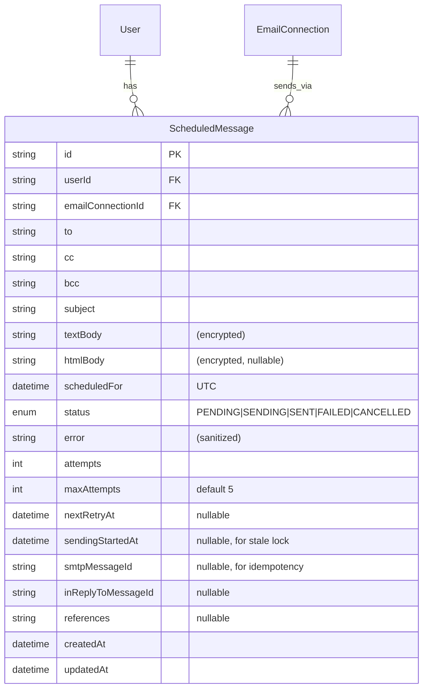

## Enhancement Summary

**Deepened on:** 2026-03-18
**Research agents used:** best-practices-researcher (x2), security-sentinel, performance-oracle, architecture-strategist, spec-flow-analyzer, learnings-researcher, repo-research-analyst, Context7 (zustand, Next.js, Prisma)

### Key Improvements from Research
1. **Use sonner for toasts** — shadcn-ecosystem toast library, supports `toast.custom()` for countdown UI, works from outside React components (zustand actions)
2. **Do NOT store email bodies in localStorage** — security risk (XSS-readable, persists after logout). Store metadata only; in-memory zustand for payloads. If tab closes during 5s window, message simply doesn't send (same as Gmail)
3. **Add `sendingStartedAt` to ScheduledMessage** — enables stale-lock recovery (SENDING stuck > 5min = reset to PENDING), mirrors existing `claimSyncLock` pattern
4. **Classify SMTP errors** — 4xx = retry with exponential backoff + jitter, 5xx = permanent failure, no retry
5. **Encrypt scheduled message bodies at rest** — use existing `encrypt()`/`decrypt()` from `src/lib/crypto.ts`
6. **Verify emailConnectionId ownership in background loop** — single query before send prevents unauthorized email delivery
7. **Record SMTP messageId after send** — enables idempotency detection on crash-recovery retries
8. **Split button on compose only** — reply composer gets a compact calendar icon, not a full split button

### Architecture Decisions (from review)
- **Zustand is correct** for the pending-send store — it's already in `package.json` and is a module-level singleton that survives React component unmounts. Use `Record<string, T>` not `Map` for serialization simplicity.
- **Client-side delay for undo-send, server-side for schedule-send** — different reliability requirements justify different architectures
- **Separate `ScheduledMessage` model** — `Message` is an IMAP cache with UID/folder semantics that don't apply to unsent content
- **Extend existing 60s sync loop** — no need for a job queue at this scale. Run scheduled-send processing _before_ IMAP sync (time-sensitive)

---

# Undo Send and Schedule Send

## Overview

Two complementary features for controlling when emails are actually delivered:

1. **Undo Send** — 5-second client-side delay between clicking Send and SMTP delivery, with a countdown toast and Undo button
2. **Schedule Send** — pick a future date/time for delivery, with background processing via the existing 60s sync loop

Both features build on the existing two send paths (compose API route + reply server action) and follow established codebase patterns.

## Problem Statement

Email sending is currently instant and irreversible. Users have no way to catch mistakes after clicking Send, and no way to time their outbound messages.

## Proposed Solution

### Feature 1: Undo Send

**Architecture: Zustand store (in-memory) + sonner toast mounted in layout**

The key architectural decision is where the countdown timer lives. It **must** survive page navigation (compose → sent, reply → sidebar click). Solution: a zustand store holding pending sends, consumed by sonner toasts mounted via `<Toaster />` in `src/app/(mail)/layout.tsx`.

**Flow:**
1. User clicks Send → payload is captured into zustand store with a 5s timer
2. Sonner countdown toast appears (bottom-left, matching shadcn ecosystem)
3. Toast shows: recipient, subject snippet, SVG progress ring countdown, "Undo" button
4. Timer expires → actual SMTP call fires (fetch to `/api/mail/send` or `replyToMessage()` server action)
5. Toast transitions to brief "Sent" confirmation, then auto-dismisses
6. Undo clicked → timer cleared, payload removed from store, compose state restored

**Edge cases handled:**
- **Navigation during countdown**: Sonner `<Toaster>` is in the layout, zustand store is module-level — both survive component unmounts
- **Tab close during countdown**: `beforeunload` handler warns user. Message simply doesn't send if force-closed (same trade-off as Gmail). No localStorage for payloads (security concern: XSS-readable, persists after logout)
- **Multiple concurrent sends**: Zustand store holds `Record<string, PendingSend>`. Sonner stacks toasts automatically
- **Reply composer state**: Body preserved in zustand store. If undone after navigating away, show notification with link to restore

### Research Insights: Undo Send

**Industry precedents:**
- Gmail: client-side delay, configurable 5/10/20/30s, no server-side queue
- Hey.com: server-side delay (owns full mail pipeline), opt-in via settings
- Superhuman: client-side delay, Cmd+Z to undo, inline countdown in conversation view
- All use the same fundamental pattern: hold message in memory, send after timer expires

**Why sonner over custom toast:**
- Used by shadcn/ui ecosystem (matches existing UI approach)
- `toast()` callable from outside React components (from zustand actions)
- `toast.custom()` for fully custom JSX (countdown progress ring)
- Automatic stacking with smooth animations
- `duration` control per-toast, `onDismiss`/`onAutoClose` callbacks
- ~1KB gzipped

**beforeunload in Next.js App Router:**
- Pure browser API, no framework magic needed
- Only handles browser-level navigation (close tab, refresh). Does NOT intercept `router.push()` or `<Link>`
- For client-side route changes: not needed — zustand store + sonner Toaster both survive App Router navigations
- The 5s undo window is too short to justify a full navigation guard

### Feature 2: Schedule Send

**Architecture: `ScheduledMessage` model + background sync loop extension**

Follows the snooze pattern: store a timestamp, check it every 60s in `syncAndNotify()`.

**Flow:**
1. User clicks schedule button (split-button dropdown on compose, calendar icon on reply) → date/time picker opens (reuses `SnoozePicker` pattern)
2. Server action creates `ScheduledMessage` record with full SMTP payload (encrypted at rest)
3. User sees confirmation, navigated to `/scheduled`
4. Background loop in `background-sync.ts` calls `sendDueScheduledMessages()` each cycle — runs BEFORE IMAP sync (time-sensitive)
5. Atomic CAS: `updateMany({ where: { id, status: PENDING }, data: { status: SENDING, sendingStartedAt: now } })` prevents duplicates
6. Verify `emailConnectionId` belongs to `userId` before sending
7. On success: record SMTP `messageId` → `createLocalSentMessage()` → mark as SENT → SSE event
8. On failure: classify error (4xx = retry with backoff + jitter, 5xx = permanent FAILED) → SSE event if permanent

**`/scheduled` page**: Lists pending/failed messages with Cancel, Edit, Send Now actions.

### Research Insights: Schedule Send

**Schema as lightweight job table (Postgres-as-job-queue pattern):**
- Separate model is correct — scheduled messages are not yet real messages (no UID, no folder, no IMAP metadata)
- After SMTP succeeds, worker calls existing `createLocalSentMessage()` to create the real `Message` row
- At Kurir's scale (single-digit users), this is more than sufficient without BullMQ or pg-boss

**Timezone handling:**
- Store `scheduledFor` in UTC always. The DB column is `DateTime` (Prisma → PostgreSQL `timestamp`)
- Convert on the client using `date-fns-tz`: `zonedTimeToUtc(localDateTime, userTimezone)` before sending to API
- Display in user's timezone: `formatInTimeZone(scheduledFor, user.timezone, "MMM d, yyyy 'at' h:mm a")`
- User.timezone stores IANA identifier (`"America/New_York"`), not offset — handles DST automatically
- DST edge case: if scheduled time doesn't exist (spring forward), `date-fns-tz` pushes to next valid moment

**Preset time options (Gmail-inspired):**
- "Later today" (6 PM) — only shown if before 4 PM in user's timezone
- "Tomorrow morning" (8 AM)
- "Tomorrow afternoon" (1 PM)
- "Next Monday morning" (8 AM) — only shown Tue-Fri

## Technical Approach

### Phase 1: Undo Send Infrastructure

#### 1.1 Install sonner

```bash
pnpm add sonner
```

Mount `<Toaster>` in the mail layout:

```tsx
// src/app/(mail)/layout.tsx
import { Toaster } from "sonner"

// Inside the layout JSX, after {children}:
<Toaster position="bottom-left" expand={false} richColors visibleToasts={4} />
```

#### 1.2 Zustand Pending-Send Store

**New file: `src/stores/pending-send-store.ts`**

```typescript
import { create } from "zustand"

interface PendingSend {
  id: string
  type: "compose" | "reply"
  payload: ComposePayload | ReplyPayload
  createdAt: number
  delayMs: number
}

interface PendingSendStore {
  pendingSends: Record<string, PendingSend>
  timers: Record<string, ReturnType<typeof setTimeout>>
  enqueue: (send: PendingSend, onExpire: () => Promise<void>) => void
  cancel: (id: string) => PendingSend | undefined
  sendNow: (id: string) => void
  complete: (id: string) => void
}
```

- Use `Record<string, T>` not `Map` — serializes to JSON trivially, no custom serializer needed
- `timers` are runtime-only, non-serializable — excluded from any persistence
- Do NOT use `persist` middleware — payloads must stay in-memory only (security: no localStorage for email bodies)
- Zustand stores are module-level singletons — survive React component unmounts by default
- Use selectors to avoid unnecessary re-renders: `usePendingSendStore((s) => Object.keys(s.pendingSends).length > 0)`

#### 1.3 Countdown Toast Component

**New file: `src/components/mail/undo-send-toast.tsx`**

Uses `toast.custom()` from sonner for fully custom JSX:

```tsx
function UndoSendToastContent({ sendId, to, delayMs, onUndo, onComplete }) {
  const { remaining, progress } = useCountdown(delayMs, onComplete)
  const seconds = Math.ceil(remaining / 1000)

  return (
    <div className="flex w-full items-center gap-3">
      {/* SVG progress ring */}
      <div className="relative h-8 w-8 shrink-0">
        <svg className="h-8 w-8 -rotate-90" viewBox="0 0 32 32">
          <circle cx="16" cy="16" r="14" fill="none" stroke="currentColor"
            strokeWidth="2" className="text-muted-foreground/20" />
          <circle cx="16" cy="16" r="14" fill="none" stroke="currentColor"
            strokeWidth="2" strokeDasharray={`${2 * Math.PI * 14}`}
            strokeDashoffset={`${2 * Math.PI * 14 * progress}`}
            strokeLinecap="round" className="text-primary transition-[stroke-dashoffset] duration-100" />
        </svg>
        <span className="absolute inset-0 flex items-center justify-center text-xs font-medium">{seconds}</span>
      </div>
      <div className="min-w-0 flex-1">
        <p className="text-sm font-medium">Sending...</p>
        <p className="truncate text-xs text-muted-foreground">To {to}</p>
      </div>
      <button onClick={onUndo}
        className="shrink-0 rounded-md bg-primary/10 px-3 py-1.5 text-xs font-medium text-primary hover:bg-primary/20">
        Undo
      </button>
    </div>
  )
}
```

**`useCountdown` hook** (`src/hooks/use-countdown.ts`):
- Updates at ~15fps (66ms intervals) for smooth progress bar, not 60fps
- Uses `Date.now()` delta for accuracy (not interval accumulation which drifts)
- Calls `onComplete` when remaining reaches 0

**`useBeforeUnload` hook** (`src/hooks/use-before-unload.ts`):
- `useEffect` that attaches `beforeunload` when `active` is true
- `e.preventDefault()` (modern standard) — no need for `returnValue` string
- Conditionally attached based on `Object.keys(pendingSends).length > 0`

#### 1.4 Compose Page Integration

**Modified file: `src/app/(mail)/compose/compose-client.tsx`**

```typescript
const handleSend = async () => {
  if (!to.trim()) { setError("Please enter a recipient"); return }

  const sendId = `send_${Date.now()}_${Math.random().toString(36).slice(2, 8)}`
  const pendingSend = { id: sendId, type: "compose", payload: { to, subject, body, fromConnectionId }, createdAt: Date.now(), delayMs: UNDO_DELAY_MS }

  // 1. Enqueue in zustand (in-memory only)
  enqueue(pendingSend, async () => {
    const res = await fetch("/api/mail/send", { method: "POST", headers: { "Content-Type": "application/json" }, body: JSON.stringify(pendingSend.payload) })
    if (!res.ok) throw new Error((await res.json()).error || "Failed to send")
  })

  // 2. Navigate away immediately — feels instant
  router.push("/sent")

  // 3. Show countdown toast (sonner, mounted in layout — survives navigation)
  showUndoSendToast(sendId, to, UNDO_DELAY_MS, () => { cancel(sendId); toast.success("Message unsent") }, ...)
}
```

#### 1.5 Reply Composer Integration

**Modified file: `src/components/mail/reply-composer.tsx`**

Same pattern as compose. Key difference: the `startTransition` call must happen only after the countdown expires, not when the user clicks Send. The `isPending` state from `useTransition` is not active during the countdown — use a separate state variable for "sending soon".

### Phase 2: Schedule Send

#### 2.1 Prisma Schema

**Modified file: `prisma/schema.prisma`**

```prisma
model ScheduledMessage {
  id                String   @id @default(cuid())
  userId            String
  emailConnectionId String
  to                String
  cc                String?
  bcc               String?
  subject           String
  textBody          String              // Encrypted at rest via crypto.ts
  htmlBody          String?             // Encrypted at rest via crypto.ts
  scheduledFor      DateTime            // Always UTC
  status            ScheduledMessageStatus @default(PENDING)
  error             String?
  attempts          Int      @default(0)
  maxAttempts       Int      @default(5)
  nextRetryAt       DateTime?           // null until first failure
  sendingStartedAt  DateTime?           // For stale-lock recovery (> 5min = stuck)
  smtpMessageId     String?             // Recorded after send for idempotency

  // Reply context (null for new compose)
  inReplyToMessageId String?
  references         String?

  createdAt DateTime @default(now())
  updatedAt DateTime @updatedAt

  user            User            @relation(fields: [userId], references: [id], onDelete: Cascade)
  emailConnection EmailConnection @relation(fields: [emailConnectionId], references: [id], onDelete: Cascade)

  @@index([userId, status, scheduledFor])
  @@index([status, scheduledFor])
  @@index([status, nextRetryAt])
}

enum ScheduledMessageStatus {
  PENDING
  SENDING
  SENT
  FAILED
  CANCELLED
}
```

**Research-informed additions vs original plan:**
- `maxAttempts` (default 5) — avoids hardcoded retry limit, configurable per message
- `nextRetryAt` — exponential backoff tracking, avoids immediate retry storms
- `sendingStartedAt` — stale-lock recovery (mirrors `syncStartedAt` in `SyncState`)
- `smtpMessageId` — idempotency: if set, skip re-send on crash recovery
- `@@index([status, nextRetryAt])` — efficient retry query
- Bodies encrypted at application level via `encrypt()`/`decrypt()` from `src/lib/crypto.ts`

Also add relation arrays:
```prisma
// On User model:
scheduledMessages ScheduledMessage[]

// On EmailConnection model:
scheduledMessages ScheduledMessage[]
```

#### 2.2 Schedule Send Server Actions

**New file: `src/actions/scheduled-messages.ts`**

All actions use `zod` validation mirroring the existing `sendSchema` in `/api/mail/send/route.ts`:

- `createScheduledMessage(data)` — auth check, validate `scheduledFor` is in future (max 1 year), validate `emailConnectionId` belongs to user, encrypt body fields, create record, `revalidateTag("sidebar-counts")`
- `cancelScheduledMessage(id)` — auth + ownership check, verify status is PENDING, set status to CANCELLED, `revalidateTag("sidebar-counts")`
- `editScheduledMessage(id, data)` — auth + ownership, status must be PENDING, re-validate `emailConnectionId` if changed, update fields, revalidate
- `sendScheduledMessageNow(id)` — auth + ownership, use CAS: `updateMany({ where: { id, status: "PENDING" }, data: { status: "SENDING", sendingStartedAt: new Date() } })`, send inline if claimed, fallback to background loop

#### 2.3 Background Loop Extension

**Modified file: `src/lib/mail/background-sync.ts`**

Run scheduled-send processing **before** IMAP sync (time-sensitive — reduces worst-case delivery latency from ~90s to ~60s):

```typescript
async function syncAndNotify() {
  // Process scheduled sends first (time-sensitive)
  await sendDueScheduledMessages().catch(console.error)

  // ... existing sync logic (wakeExpiredSnoozes, IMAP sync, etc.)
}

async function sendDueScheduledMessages() {
  const now = new Date()
  const staleThreshold = new Date(Date.now() - 5 * 60 * 1000)

  // Atomic claim — prevents duplicate sends. Also recovers stale SENDING locks.
  const claimed = await prisma.scheduledMessage.updateMany({
    where: {
      OR: [
        { status: "PENDING", scheduledFor: { lte: now } },
        { status: "PENDING", nextRetryAt: { lte: now } },
        { status: "SENDING", sendingStartedAt: { lt: staleThreshold } }, // Stale lock recovery
      ],
    },
    data: { status: "SENDING", sendingStartedAt: now },
  })
  if (claimed.count === 0) return

  const toSend = await prisma.scheduledMessage.findMany({
    where: { status: "SENDING" },
    include: { emailConnection: true },
  })

  for (const msg of toSend) {
    // Idempotency: if SMTP messageId already recorded, skip re-send
    if (msg.smtpMessageId) {
      await prisma.scheduledMessage.update({ where: { id: msg.id }, data: { status: "SENT" } })
      continue
    }

    // Ownership verification
    const connection = await prisma.emailConnection.findFirst({
      where: { id: msg.emailConnectionId, userId: msg.userId },
    })
    if (!connection) {
      await prisma.scheduledMessage.update({
        where: { id: msg.id },
        data: { status: "FAILED", error: "Email connection not found or unauthorized" },
      })
      continue
    }

    try {
      const result = await sendScheduledEmail(msg, connection)

      // Record SMTP messageId FIRST (idempotency checkpoint)
      await prisma.scheduledMessage.update({
        where: { id: msg.id },
        data: { smtpMessageId: result.messageId, status: "SENT" },
      })

      await createLocalSentMessage(/* ... */)
      emitToUser(msg.userId, { type: "scheduled-sent", data: { scheduledMessageId: msg.id } })
    } catch (error) {
      const attempts = msg.attempts + 1
      const permanent = isSmtpPermanentError(error) || attempts >= msg.maxAttempts

      if (permanent) {
        await prisma.scheduledMessage.update({
          where: { id: msg.id },
          data: { status: "FAILED", attempts, error: sanitizeError(error) },
        })
        emitToUser(msg.userId, {
          type: "scheduled-failed",
          data: { scheduledMessageId: msg.id, error: "Failed to send — check email connection settings" },
        })
      } else {
        const delay = getNextRetryDelay(attempts) // Exponential: 1m, 5m, 15m, 1h, 4h + jitter
        await prisma.scheduledMessage.update({
          where: { id: msg.id },
          data: { status: "PENDING", attempts, nextRetryAt: new Date(Date.now() + delay), error: sanitizeError(error) },
        })
      }
    }
  }
}

function isSmtpPermanentError(error: unknown): boolean {
  const msg = String(error)
  return /^5\d{2}\b/.test(msg) || /Invalid recipient|mailbox not found/i.test(msg)
}

function getNextRetryDelay(attempts: number): number {
  const delays = [60_000, 300_000, 900_000, 3_600_000, 14_400_000] // 1m, 5m, 15m, 1h, 4h
  const base = delays[Math.min(attempts - 1, delays.length - 1)]
  return base + base * 0.2 * (Math.random() * 2 - 1) // +/- 20% jitter
}

function sanitizeError(error: unknown): string {
  // Strip internal details (SMTP host, port, IPs) — store only user-friendly message
  return String(error).slice(0, 500).replace(/\b\d{1,3}(\.\d{1,3}){3}\b/g, "[redacted]")
}
```

#### 2.4 Schedule Picker Component

**New file: `src/components/mail/schedule-picker.tsx`**

Reuses the `SnoozePicker` pattern (`src/components/mail/snooze-picker.tsx`):
- Preset options (timezone-aware, computed via `date-fns-tz`):
  - "Later today" (6 PM) — only shown before 4 PM
  - "Tomorrow morning" (8 AM)
  - "Tomorrow afternoon" (1 PM)
  - "Next Monday morning" (8 AM) — only shown Tue-Fri
  - "Custom..." → calendar + time picker
- Custom: date/time picker using the user's timezone (`buildDateInTimezone` from snooze-picker)
- Renders as a Popover triggered from dropdown button next to Send

#### 2.5 Send Button Split

**Modified files: `compose-client.tsx`, `reply-composer.tsx`**

**Compose page**: Split button component:
- Left: "Send" (with undo delay) — primary action
- Right: dropdown chevron → "Schedule Send" opens `SchedulePicker`
- Accessible: `aria-haspopup="true"`, `aria-expanded`, Escape closes, arrow keys navigate

**Reply composer**: Compact calendar icon button next to Send — no full split button (too crowded for inline widget).

#### 2.6 Scheduled Messages Page

**New file: `src/app/(mail)/scheduled/page.tsx`**

- Lists `ScheduledMessage` records where `status` is PENDING or FAILED, ordered by `scheduledFor`
- Each row: recipient, subject snippet (via `createSnippet()` from persist-sent.ts), scheduled time (relative + absolute in user's timezone), status badge
- Actions per row: Cancel, Edit, Send Now
- Edit navigates to `/compose?editScheduled=<id>` with pre-filled fields
- Failed messages show sanitized error and "Retry" button
- Sent/Cancelled messages not shown (can add a "History" toggle later)

#### 2.7 Sidebar Entry

**Modified file: `src/components/layout/sidebar.tsx`**

Add "Scheduled" entry between "Snoozed" and "Sent" with count of PENDING messages. Only show when count > 0.

Badge count via `unstable_cache` with `sidebar-counts` tag (consistent with existing pattern):

```typescript
const getScheduledCount = unstable_cache(
  async (userId: string) =>
    db.scheduledMessage.count({ where: { userId, status: "PENDING" } }),
  ["scheduled-count"],
  { tags: ["sidebar-counts"], revalidate: 30 },
)
```

#### 2.8 SSE Events

**Modified file: `src/lib/mail/sse-subscribers.ts`**

```typescript
export type MailEvent =
  | { type: "new-messages"; data: { folderId: string; count: number } }
  | { type: "flags-changed"; data: { messageId: string; flags: Record<string, boolean> } }
  | { type: "message-deleted"; data: { messageId: string } }
  | { type: "scheduled-sent"; data: { scheduledMessageId: string } }
  | { type: "scheduled-failed"; data: { scheduledMessageId: string; error: string } }
```

**Modified file: `src/components/mail/auto-sync.tsx`**

Listen for `scheduled-sent` → show success sonner toast + `router.refresh()`.
Listen for `scheduled-failed` → show error sonner toast + `router.refresh()`.

**Also fix pre-existing SSE heartbeat cleanup bug:** If the heartbeat `controller.enqueue` throws (stream closed), clean up the subscriber to prevent memory leak:

```typescript
const heartbeat = setInterval(() => {
  try { controller.enqueue(encoder.encode(": heartbeat\n\n")) }
  catch { subscribers.delete(send); clearInterval(heartbeat) }
}, 30_000)
```

#### 2.9 Body Encryption at Rest

**Modified file: `src/actions/scheduled-messages.ts`**

Use existing `encrypt()`/`decrypt()` from `src/lib/crypto.ts` (already used for `EmailConnection.encryptedPassword`):

```typescript
import { encrypt, decrypt } from "@/lib/crypto"

// On create:
const record = await prisma.scheduledMessage.create({
  data: {
    ...data,
    textBody: encrypt(data.textBody),
    htmlBody: data.htmlBody ? encrypt(data.htmlBody) : null,
  },
})

// On read (for edit, or background send):
const msg = await prisma.scheduledMessage.findFirst({ where: { id } })
const textBody = decrypt(msg.textBody)
const htmlBody = msg.htmlBody ? decrypt(msg.htmlBody) : null
```

## Acceptance Criteria

### Undo Send
- [ ] Clicking Send on compose shows sonner countdown toast with 5s timer
- [ ] Clicking Send on reply shows sonner countdown toast with 5s timer
- [ ] Clicking "Undo" cancels the send and restores compose/reply state
- [ ] Toast persists when navigating between pages (layout-mounted)
- [ ] `beforeunload` warning fires during active countdown
- [ ] Multiple concurrent pending sends display as stacked toasts
- [ ] After timer expires, message is sent via SMTP and persisted to Sent folder
- [ ] Tab close during countdown = message not sent (no silent data loss)

### Schedule Send
- [ ] Split button on compose page shows "Schedule Send" dropdown
- [ ] Calendar icon on reply composer opens schedule picker
- [ ] Schedule picker shows timezone-aware preset times + custom date/time
- [ ] Scheduled message bodies are encrypted at rest
- [ ] Background loop sends due messages (runs before IMAP sync each cycle)
- [ ] Atomic CAS prevents duplicate sends; stale SENDING locks auto-recover after 5min
- [ ] SMTP messageId recorded for idempotency on crash-recovery retries
- [ ] emailConnectionId ownership verified before background send
- [ ] SMTP errors classified: 4xx = retry with exponential backoff + jitter, 5xx = permanent FAILED
- [ ] SSE events with sanitized errors notify user of send/failure
- [ ] `/scheduled` page lists pending/failed messages with Cancel, Edit, Send Now
- [ ] Sidebar shows "Scheduled" with count badge (unstable_cache + sidebar-counts tag)
- [ ] Deleting an EmailConnection cascades to its scheduled messages (warn user first)
- [ ] zod validation on all server action inputs

## Key Files to Modify/Create

| File | Action | Purpose |
|------|--------|---------|
| `src/components/mail/undo-send-toast.tsx` | Create | Countdown toast with progress ring |
| `src/stores/pending-send-store.ts` | Create | Zustand store (in-memory, no persist) |
| `src/hooks/use-countdown.ts` | Create | Countdown timer hook (15fps) |
| `src/hooks/use-before-unload.ts` | Create | beforeunload handler hook |
| `src/app/(mail)/compose/compose-client.tsx` | Modify | Integrate undo-send + split button |
| `src/components/mail/reply-composer.tsx` | Modify | Integrate undo-send + schedule icon |
| `src/app/(mail)/layout.tsx` | Modify | Mount sonner `<Toaster>` |
| `prisma/schema.prisma` | Modify | Add `ScheduledMessage` model + enum |
| `src/actions/scheduled-messages.ts` | Create | CRUD server actions with zod + encryption |
| `src/lib/mail/background-sync.ts` | Modify | Add `sendDueScheduledMessages()` before sync |
| `src/lib/mail/scheduled-send.ts` | Create | `sendScheduledEmail()` helper, error classification |
| `src/components/mail/schedule-picker.tsx` | Create | Date/time picker (reuse SnoozePicker pattern) |
| `src/app/(mail)/scheduled/page.tsx` | Create | Scheduled messages list page |
| `src/components/layout/sidebar.tsx` | Modify | Add Scheduled nav entry with badge |
| `src/lib/mail/sse-subscribers.ts` | Modify | Add scheduled event types |
| `src/components/mail/auto-sync.tsx` | Modify | Listen for scheduled events + fix heartbeat cleanup |

## Dependencies & Risks

- **sonner** (`pnpm add sonner`): Toast library for countdown UI. ~1KB gzipped, shadcn ecosystem.
- **date-fns-tz**: Timezone conversion for schedule picker. Tree-shakeable, handles DST.
- **Tab close = message not sent**: Accepted trade-off for undo-send (same as Gmail). No localStorage for email bodies.
- **60-second send granularity**: Scheduled messages may send up to 59s late. Acceptable for email scheduling.
- **SMTP credential changes**: If credentials change between scheduling and sending, the send fails and retry handles it. emailConnectionId ownership verified each time.
- **Stale SENDING recovery**: Messages stuck in SENDING > 5min are auto-reset. smtpMessageId prevents double-send.

## Security Considerations

| Risk | Mitigation |
|------|------------|
| Email bodies in localStorage (XSS-readable) | Do NOT persist to localStorage. In-memory zustand only. |
| Plaintext scheduled message bodies in DB | Encrypt at rest using existing `encrypt()`/`decrypt()` from `crypto.ts` |
| Background loop sends without request auth | Verify `emailConnectionId` belongs to `userId` before every send |
| Stale SENDING lock = missed send | `sendingStartedAt` + 5min TTL auto-recovery (mirrors `claimSyncLock`) |
| Double-send on crash recovery | Record `smtpMessageId` immediately after `sendMail()` success |
| SMTP errors leak infra details in SSE | `sanitizeError()` strips IPs, hostnames; user-friendly messages only |
| No global CSP header | Pre-existing issue — add global CSP in `next.config.ts` (defense-in-depth) |
| Scheduled messages persist forever | Add retention policy: delete SENT/CANCELLED records after 30 days |

## ERD



## Implementation Order

1. **Phase 1a: Undo Send infra** — `pnpm add sonner`, create zustand store, hooks, toast component
2. **Phase 1b: Undo Send integration** — modify compose-client.tsx + reply-composer.tsx + layout.tsx
3. **Phase 2a: Schedule Send schema** — add ScheduledMessage model, `pnpm db:push`, add relation arrays
4. **Phase 2b: Schedule Send backend** — server actions (with zod + encryption), background loop extension, SSE events
5. **Phase 2c: Schedule Send UI** — schedule picker, split button, `/scheduled` page, sidebar entry
6. **Phase 2d: Edge cases** — stale lock recovery, retry backoff, connection deletion warning, heartbeat fix
