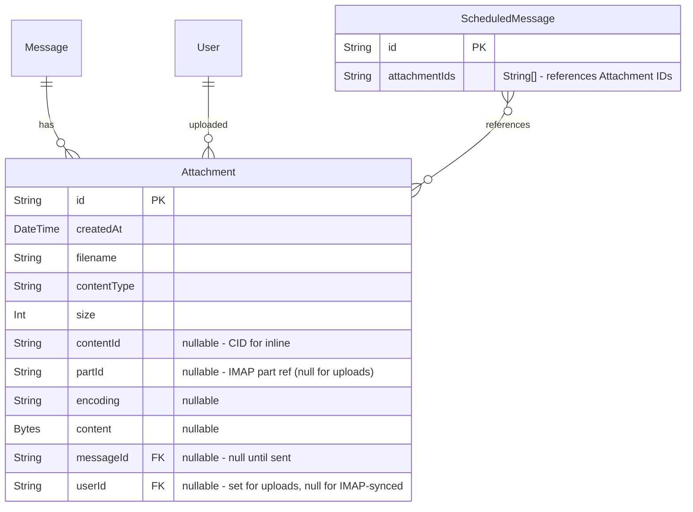

# Attachments, Inline Images, Compose Upgrade & Forward

## Overview

Add file attachment support (upload-first model), a GitHub-style markdown composer with Write/Preview toggle, inline image embedding, and message forwarding to Kurir. This touches the reply composer, compose-new page, send paths (immediate + scheduled), IMAP sent append, and the Prisma data model.

## Problem Statement / Motivation

Kurir currently sends text-only emails with no way to attach files, embed images, or forward messages. These are table-stakes email features. The plain textarea composer also has no formatting preview, making it hard to compose anything beyond simple text replies.

## Proposed Solution

**GitHub-style markdown composer** with Write/Preview tabs, **upload-first attachments** (files upload immediately via API, send only passes IDs), **CID inline images** in outgoing email, and a **forward flow** that navigates to `/compose?forward={messageId}` with pre-populated content and carried-over attachments.

## Technical Approach

### Architecture

```
┌─────────────────────────────────────────────────────┐
│  Client                                             │
│                                                     │
│  MarkdownComposer (shared component)                │
│  ├─ Write tab: <textarea> with drag/drop/paste      │
│  ├─ Preview tab: rendered markdown (marked + prose)  │
│  ├─ AttachmentChips: removable file chips            │
│  └─ useAttachments() hook: upload/remove/state       │
│                                                     │
│  Used by:                                           │
│  ├─ compose-client.tsx (compose-new + forward)       │
│  └─ reply-composer.tsx (reply)                       │
└──────────┬──────────────────────────────┬───────────┘
           │ POST /api/attachments        │ POST /api/mail/send
           │ DELETE /api/attachments/[id]  │ replyToMessage()
           ▼                              ▼
┌─────────────────────────────────────────────────────┐
│  Server                                             │
│                                                     │
│  Upload route: validate, store Bytes in Postgres     │
│  Send path: load attachments by ID, convert md→HTML, │
│    rewrite inline images to CID, pass to nodemailer  │
│  Persist: link attachments to sent Message,          │
│    include in MailComposer for IMAP Sent append       │
└─────────────────────────────────────────────────────┘
```

### ERD Changes



### Implementation Phases

#### Phase 1: Data Model & Upload API

Schema changes and the upload/serve/delete endpoints. Foundation for everything else.

**Prisma schema changes** (`prisma/schema.prisma`):

```prisma
model Attachment {
  id        String   @id @default(cuid())
  createdAt DateTime @default(now())

  filename    String
  contentType String
  size        Int
  contentId   String?

  // IMAP-specific (null for user uploads)
  partId   String?
  encoding String?

  // Content (populated immediately for uploads, lazy for IMAP)
  content Bytes?

  // Relations - both nullable
  messageId String?
  message   Message? @relation(fields: [messageId], references: [id], onDelete: Cascade)

  // Upload ownership (null for IMAP-synced attachments)
  userId String?
  user   User?    @relation(fields: [userId], references: [id], onDelete: Cascade)

  @@index([messageId])
  @@index([contentId])
  @@index([userId, messageId])
}
```

Add to `ScheduledMessage`:

```prisma
  attachmentIds String[] @default([])
```

Add to `User`:

```prisma
  attachments Attachment[]
```

**Files to create/modify:**

- [x] `prisma/schema.prisma` — model changes above
- [x] `src/app/api/attachments/upload/route.ts` — `POST` handler:
  - Auth check via `auth()`
  - Accept `multipart/form-data` with single `file` field
  - Validate: file size <= 10MB, reject if user's pending uploads exceed 25MB total
  - Store in DB with `userId`, `messageId: null`, `partId: null`
  - Return `{ id, filename, contentType, size, url: "/api/attachments/{id}" }`
  - Rate limit: new bucket in `src/lib/rate-limit.ts` (e.g., 30 uploads/min)
- [x] `src/app/api/attachments/[id]/route.ts` — modify existing GET:
  - Support uploaded attachments (no IMAP fallback path when `partId` is null)
  - Ownership: check `attachment.userId` OR `attachment.message.userId`
  - `Content-Disposition: inline` for image types, `attachment` for others
  - Add `DELETE` handler: auth + ownership check, only delete if `messageId` is null
- [x] Run `pnpm db:push` and `pnpm db:generate`

**Acceptance criteria:**

- [x] Can upload a file via POST, get back ID and URL
- [x] Can serve uploaded file via GET with correct Content-Type
- [x] Can delete an uploaded (unlinked) attachment
- [x] Cannot delete an attachment linked to a sent message
- [x] Cannot access another user's uploads
- [x] Files over 10MB are rejected
- [x] Total pending uploads over 25MB are rejected

---

#### Phase 2: Markdown Composer Component

Shared GitHub-style composer with Write/Preview tabs, used by both compose and reply.

**Dependencies to install:**

```bash
pnpm add marked
```

(`marked` — lightweight, GFM built-in, works server-side for send-time conversion. `@tailwindcss/typography` already installed for prose styling.)

**Files to create/modify:**

- [x] `src/hooks/use-attachments.ts` — attachment upload/remove/state hook:

  ```typescript
  interface UploadedAttachment {
    id: string;
    filename: string;
    contentType: string;
    size: number;
    url: string;
    status: "uploading" | "done" | "error";
    progress?: number; // 0-100
  }

  function useAttachments() {
    // Returns: { attachments, upload(file), remove(id), totalSize, isUploading, insertImageMarkdown }
    // upload(): POST /api/attachments/upload, manage state
    // remove(): DELETE /api/attachments/{id}, remove from state
    // insertImageMarkdown: callback that returns markdown string for cursor insertion
  }
  ```

- [x] `src/components/mail/markdown-composer.tsx` — shared composer component:
  - Props: `value`, `onChange`, `placeholder`, `disabled`, `attachments` (from hook), `onFileDrop`, `onFilePaste`
  - **Write tab**: `<textarea>` with existing auto-resize behavior
  - **Preview tab**: render markdown via `marked` into `<div className="prose prose-sm">`
  - **Tabs**: use existing `src/components/ui/tabs.tsx` (Radix)
  - **Drag & drop**: `onDragOver`/`onDrop` on the composer container, visual drop zone overlay
  - **Clipboard paste**: `onPaste` on textarea — detect `clipboardData.files` for images vs text
  - **File picker**: paperclip button triggers hidden `<input type="file" multiple>`
  - **Cursor insertion**: when an image uploads, insert `` at cursor position using `selectionStart`/`selectionEnd`; use a `` placeholder during upload, replaced on completion
  - **Attachment chips**: below textarea, show non-image files as removable chips (`filename + size + X button`)

- [x] `src/components/mail/attachment-chips.tsx` — removable file chip list:
  - Each chip: `Paperclip` icon + filename + formatted size + `X` button
  - Uploading state: `Loader2` spinner instead of Paperclip
  - Error state: red text + retry button

**Acceptance criteria:**

- [x] Write/Preview tabs toggle correctly
- [x] Preview renders markdown (headings, bold, italic, code, links, lists, tables, images)
- [x] Drag & drop a file onto composer triggers upload
- [x] Paste a screenshot from clipboard triggers upload + markdown insertion
- [x] File picker button opens file dialog
- [x] Image uploads insert `` at cursor position in textarea
- [x] Non-image uploads appear as removable chips
- [x] Removing a chip calls DELETE endpoint
- [x] Visual drop zone overlay on drag-over
- [x] Upload progress/spinner shown during upload
- [x] Error state shown on upload failure

---

#### Phase 3: Integrate into Compose & Reply

Wire the markdown composer and attachment hook into the existing compose and reply flows.

**Files to modify:**

- [x] `src/app/(mail)/compose/compose-client.tsx` — replace textarea with `MarkdownComposer`:
  - Add `useAttachments()` hook
  - Pass attachments + handlers to `MarkdownComposer`
  - On send: include `attachmentIds` in POST body to `/api/mail/send`
  - On undo: save and restore attachment state (store attachment list in ref)
  - On schedule: include `attachmentIds` in `createScheduledMessage` call
  - Validate: block send if any uploads still in progress
  - Convert markdown to HTML via `marked` before send (pass as `html` field)

- [x] `src/components/mail/reply-composer.tsx` — replace textarea with `MarkdownComposer`:
  - Add `useAttachments()` hook
  - Pass attachments + handlers to `MarkdownComposer`
  - On send: include `attachmentIds` in `replyToMessage()` call
  - On undo: save/restore attachment state alongside body and to
  - Validate: block send if uploads in progress

- [x] `src/app/api/mail/send/route.ts` — extend send schema + handler:
  - Add `attachmentIds: z.array(z.string()).optional()` to zod schema
  - Load attachment content from DB: `db.attachment.findMany({ where: { id: { in: ids }, userId } })`
  - Verify ownership (all attachments belong to current user)
  - Verify total size <= 25MB
  - Build nodemailer `attachments` array: `{ filename, content: Buffer, contentType, cid? }`
  - For inline images (those referenced as `` in markdown):
    - Generate CID: `{id}@kurir`
    - Replace `` in HTML with ``
    - Add to nodemailer attachments with `cid` field set
  - After send: link attachments to created message (`db.attachment.updateMany({ where: { id: { in: ids } }, data: { messageId } })`)
  - Set `hasAttachments: true` on the created Message

- [x] `src/actions/reply.ts` — extend `replyToMessage()`:
  - Add `attachmentIds?: string[]` parameter
  - Same attachment loading, CID rewriting, and linking logic as compose send
  - Pass attachments to `transporter.sendMail()`
  - Pass attachments to `createLocalSentMessage()` and `appendToImapSent()`

- [x] `src/lib/mail/persist-sent.ts` — extend for attachments:
  - `createLocalSentMessage()`: accept attachments param, link attachment rows to new message, set `hasAttachments: true`
  - `appendToImapSent()`: accept attachments param, include in `MailComposer` options

- [x] `src/lib/mail/scheduled-send.ts` — extend `sendScheduledEmail()`:
  - Load attachments from `scheduledMessage.attachmentIds`
  - Include in `transporter.sendMail()` with CID rewriting for inline images
  - Link attachments to created message after send

- [x] `src/actions/scheduled-messages.ts` — extend `createScheduledMessage()`:
  - Accept `attachmentIds` param, store on `ScheduledMessage`

- [x] `src/lib/mail/markdown-to-email.ts` — new utility:
  - `convertMarkdownToEmailHtml(markdown: string): string`
  - Use `marked` to convert markdown to HTML
  - Wrap in minimal email-safe HTML boilerplate (charset, viewport)
  - Inline basic styles for email client compatibility (simple `<style>` block with element selectors — `p`, `h1`-`h6`, `code`, `pre`, `blockquote`, `table`, `a`, `img`)
  - Rewrite `/api/attachments/{id}` image URLs to `cid:{id}@kurir`
  - Return both the HTML string and a list of extracted attachment IDs (for CID mapping)

**Acceptance criteria:**

- [x] Compose-new sends emails with attachments (visible in recipient's email client)
- [x] Reply sends emails with attachments
- [x] Inline images render correctly in recipient's email client (CID embedded)
- [x] Markdown body renders as HTML in recipient's email client
- [x] Sent message in IMAP Sent folder includes attachments
- [x] Local sent message shows attachments in thread view
- [x] Undo-send restores attachments in both compose and reply
- [x] Scheduled send includes attachments when fired
- [x] Cannot send while uploads are in progress
- [x] `hasAttachments` flag set correctly on sent messages

---

#### Phase 4: Forward

Forward button on messages, navigating to `/compose` with pre-populated content.

**Files to create/modify:**

- [x] `src/components/mail/thread-view.tsx` — add Forward button:
  - Add `Forward` icon button (from `lucide-react`) alongside existing message actions
  - On click: navigate to `/compose?forward={messageId}`

- [x] `src/app/(mail)/compose/page.tsx` — handle forward params:
  - Read `searchParams.forward` (message ID)
  - Fetch original message: subject, body (text), fromAddress, attachments
  - Verify ownership
  - Pass forward data to `ComposeClientPage`

- [x] `src/app/(mail)/compose/compose-client.tsx` — handle forward pre-population:
  - Accept optional `forwardData` prop
  - Pre-fill subject: `Fwd: {original subject}`
  - Pre-fill body with forwarded header block:

    ```

    ---------- Forwarded message ----------
    From: {fromAddress}
    Date: {date}
    Subject: {subject}

    {original plain text body}
    ```

  - Pre-load original attachments into `useAttachments` state (already uploaded, status "done")
  - User can edit body, add/remove attachments, pick recipient, then send
  - Forward uses compose send path (not reply) — no `inReplyTo` or `references` headers

- [x] `src/components/mail/keyboard-shortcuts.tsx` — add `f` for forward (optional)

**Acceptance criteria:**

- [x] Forward button visible on messages in thread view
- [x] Clicking Forward navigates to compose with pre-populated subject and body
- [x] Original attachments carried over and shown as chips / inline images
- [x] User can add new attachments and remove original ones
- [x] Forwarded message sends correctly with all attachments
- [x] No `In-Reply-To` or `References` headers on forwarded messages
- [x] Forward uses FromPicker (user chooses which connection to send from)

---

#### Phase 5: Cleanup & Polish

Orphan cleanup, CID fix for received emails, and UX polish.

**Files to create/modify:**

- [x] `src/lib/jobs/maintenance-worker.ts` — extend attachment cleanup:
  - New task: delete `Attachment` rows where `messageId IS NULL` AND `userId IS NOT NULL` AND `createdAt < 24h ago` AND `id NOT IN (SELECT unnest(attachmentIds) FROM ScheduledMessage)`
  - Runs alongside existing `expireOldAttachments`

- [x] `src/lib/mail/sanitize-html.ts` — fix CID inline images in received emails:
  - When sanitizing email HTML, rewrite `src="cid:xxx"` to `src="/api/attachments/{id}"` by looking up the message's attachments where `contentId` matches
  - Requires passing the message's attachment list to the sanitizer

- [x] `src/components/mail/thread-view.tsx` — pass attachments to sanitizer for CID rewriting

- [x] `src/components/mail/thread-page-content.tsx` — fix optimistic reply:
  - Include attachment data in optimistic message so they appear immediately

- [x] `src/components/mail/reply-composer.tsx` — save/restore attachment state on undo

**Acceptance criteria:**

- [x] Orphaned uploads cleaned up after 24 hours
- [x] Scheduled message attachments NOT cleaned up
- [x] Received emails with CID inline images display correctly
- [x] Optimistic reply messages show attachments
- [x] Undo-send fully restores attachment state

---

## Key Design Decisions

| Decision                    | Choice                                              | Rationale                                                                              |
| --------------------------- | --------------------------------------------------- | -------------------------------------------------------------------------------------- |
| Storage                     | Postgres `Bytes` column                             | Simplest, no external deps. Swap to S3 later via storage abstraction.                  |
| Upload model                | Upload-first (immediate)                            | GitHub model. Fast send, instant feedback, clean undo-send.                            |
| Attachment model            | Extend existing, make `partId`/`messageId` nullable | Less schema fragmentation than a separate table. GET route already handles both paths. |
| Markdown library            | `marked`                                            | Lightweight, GFM built-in, works server-side.                                          |
| Email HTML styling          | Inline styles via utility function                  | Simpler than adding `juice` dep. Basic element styles sufficient.                      |
| Inline images in email      | CID rewriting at send time                          | Email-standard. Works offline for recipients.                                          |
| Forward navigation          | `/compose?forward={messageId}`                      | Reuses existing compose page. Avoids dual inline composers.                            |
| Forward body format         | Plain text with standard forwarded header           | Composer is plain text. HTML→markdown conversion would be lossy.                       |
| Orphan cleanup              | 24h TTL, exclude scheduled message refs             | Balances storage vs. abandoned compose sessions.                                       |
| Max per file                | 10MB                                                | User-specified.                                                                        |
| Max total per message       | 25MB                                                | Common SMTP server limit.                                                              |
| Max attachments per message | 20                                                  | Generous but prevents abuse.                                                           |

## Dependencies & Risks

| Risk                                                 | Mitigation                                                                                                                                           |
| ---------------------------------------------------- | ---------------------------------------------------------------------------------------------------------------------------------------------------- |
| Large Bytes columns bloat Postgres                   | Phase 2 of storage: migrate to S3. Monitor DB size.                                                                                                  |
| CID rewriting is fragile (regex on HTML)             | Use the markdown→HTML pipeline — we control the output format, so image URLs are predictable (`/api/attachments/{id}` pattern).                      |
| Orphan cleanup deletes scheduled message attachments | Explicitly exclude IDs referenced in `ScheduledMessage.attachmentIds`.                                                                               |
| Markdown preview XSS                                 | `marked` output is rendered in a `prose` div with `dangerouslySetInnerHTML` — sanitize via `marked`'s built-in sanitizer or DOMPurify on the output. |
| SMTP rejects large messages                          | Enforce 25MB total before send. Show clear error if exceeded.                                                                                        |

## References & Research

### Internal References

- Brainstorm: `docs/brainstorms/2026-03-21-attachments-and-compose-brainstorm.md`
- Attachment model: `prisma/schema.prisma:315-338`
- Attachment GET route: `src/app/api/attachments/[id]/route.ts`
- Reply action: `src/actions/reply.ts`
- Compose send route: `src/app/api/mail/send/route.ts`
- Compose client: `src/app/(mail)/compose/compose-client.tsx`
- Reply composer: `src/components/mail/reply-composer.tsx`
- Persist sent: `src/lib/mail/persist-sent.ts`
- Scheduled send: `src/lib/mail/scheduled-send.ts`
- Thread view: `src/components/mail/thread-view.tsx`
- Sanitizer: `src/lib/mail/sanitize-html.ts`
- Maintenance worker: `src/lib/jobs/maintenance-worker.ts`
- Tabs UI component: `src/components/ui/tabs.tsx`

### Institutional Learnings Applied

- `docs/solutions/integration-issues/sent-messages-missing-from-thread-views.md` — use shared `persist-sent.ts` helper, link attachments to message after send
- `docs/solutions/performance-issues/sync-timeout-on-large-mailboxes.md` — batch large operations
- `docs/solutions/feature-implementations/auto-archive-rejected-screener-messages.md` — ImapFlow API type safety
