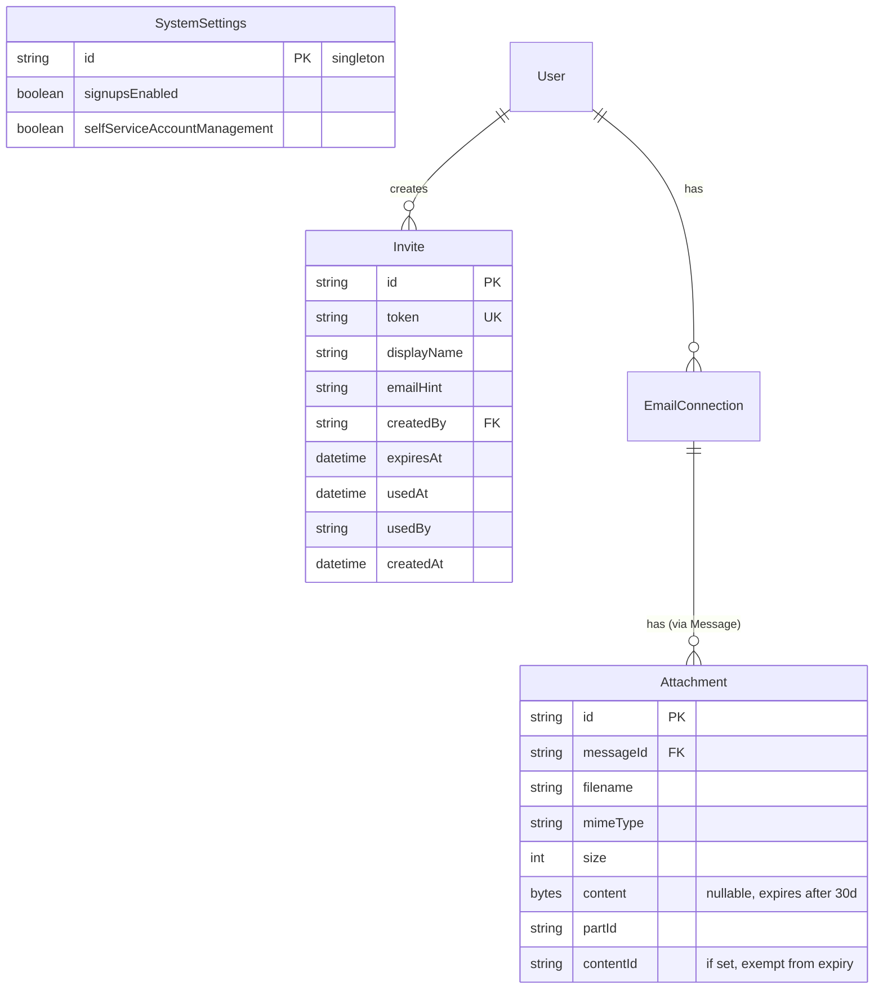

# Multi-User Scaling (10-30 Users)

## Overview

Scale Kurir from a single-user deployment to support 10-30 users (family, team, small org). Adds Redis + BullMQ for sync job scheduling, caps IDLE connections, implements attachment expiry, adds an admin dashboard, admin invites, self-service account management toggle, rate limiting, and a health endpoint.

## Problem Statement

The current architecture is single-user by design:

1. **Sequential sync loop** — `setInterval` iterates all users one-by-one every 60s. With 30 users x 2 connections, a single cycle takes 15+ minutes
2. **Unbounded IDLE connections** — Each email connection gets a persistent TCP/TLS IDLE connection with no cap (30 users x 2 = 60+ simultaneous connections)
3. **Memory-heavy operations** — `repairThreadIds()` loads all messages per user into memory; `simpleParser` buffers full message sources
4. **No job queue** — All background work runs via `setInterval` in the main process
5. **No rate limiting** — One user's large mailbox sync can starve everyone
6. **Attachments stored forever** — `Bytes` in Postgres with no expiry
7. **Minimal admin tooling** — Basic user list and signups toggle; no visibility into sync health
8. **No invite system** — Users either self-register or are created via CLI

## Proposed Solution

**Hybrid approach**: Optimize in-process bottlenecks first, then add Redis + BullMQ for the sync queue (the #1 bottleneck). Keep SSE and ConnectionManager in-process — they work fine single-process at this scale.

### Infrastructure Changes

- **Add Redis** — New dependency for BullMQ job queue and rate limiting
- **Upgrade server** — 2GB → 8GB RAM
- **Bump Prisma pool** — Default ~5 → 15 connections via `?connection_limit=15` in `DATABASE_URL`

## Technical Approach

### Architecture

```
┌─────────────────────────────────────────────────────┐
│                   Next.js Process                    │
│                                                      │
│  ┌──────────┐  ┌──────────────┐  ┌───────────────┐  │
│  │ API/SSR  │  │  BullMQ      │  │ Connection    │  │
│  │ Routes   │  │  Workers     │  │ Manager       │  │
│  │          │  │              │  │ (IDLE cap=25) │  │
│  └────┬─────┘  └──────┬───────┘  └───────┬───────┘  │
│       │               │                  │           │
│  ┌────┴───────────────┴──────────────────┴────────┐  │
│  │              SSE Subscribers (in-memory)        │  │
│  │              Echo Suppression (in-memory)       │  │
│  └────────────────────────────────────────────────┘  │
└───────────┬───────────────────┬──────────────────────┘
            │                   │
      ┌─────┴─────┐      ┌─────┴─────┐
      │ PostgreSQL │      │   Redis   │
      │  (data)    │      │ (jobs,    │
      │            │      │  rate     │
      │            │      │  limits)  │
      └────────────┘      └───────────┘
```

**Single-process constraint preserved.** ConnectionManager, SSE subscribers, and echo suppression remain in-memory singletons. BullMQ worker runs in the same process for scheduling/prioritization, not multi-process scaling.

### Implementation Phases

#### Phase 1: Infrastructure & Quick Wins

Add Redis, bump Prisma pool, parallel sync. No new UI — just backend improvements.

**1.1 Add Redis to Docker Compose and Kamal**

```yaml
# docker-compose.yml — new service
redis:
  image: redis:7-alpine
  ports:
    - "6379:6379"
  volumes:
    - redis_data:/data
```

```yaml
# config/deploy.yml — new accessory
redis:
  image: redis:7-alpine
  host: kurir-app-1.banded-beta.ts.net
  port: 6379
  cmd: redis-server --maxmemory 256mb --maxmemory-policy allkeys-lru
  directories:
    - data:/data
```

New env vars: `REDIS_URL=redis://localhost:6379` in docker-compose and `.kamal/secrets`.

Files:
- `docker-compose.yml`
- `config/deploy.yml`
- `.kamal/secrets`

**1.2 Bump Prisma connection pool**

Append `?connection_limit=15` to `DATABASE_URL`. Coordinate with PostgreSQL `max_connections` (default 100 — 15 Prisma + headroom is fine).

Files:
- `docker-compose.yml` (DATABASE_URL)
- `config/deploy.yml` (env)

**1.3 Replace sync loop with BullMQ**

Replace `setInterval` in `background-sync.ts` with BullMQ repeatable jobs.

**Job types:**

| Job Type | Schedule | Concurrency | Retry | Priority |
|---|---|---|---|---|
| `sync-connection` | Every 60s per connection | 5 | 3 attempts, exponential backoff | Higher for users with active SSE |
| `scheduled-send` | Every 30s (global) | 1 | Existing retry logic (5 attempts) | Normal |
| `wake-snoozes` | Every 60s (global) | 1 | 1 | Normal |
| `check-follow-ups` | Every 60s (global) | 1 | 1 | Normal |
| `expire-attachments` | Every 24h (global) | 1 | 1 | Low |

**"Recently active" = user has an active SSE connection.** Check `sseSubscribers.has(userId)` to determine priority. Active users get BullMQ priority 1 (high), inactive get priority 10 (low).

**Sync lock strategy:** Keep the Postgres `SyncState.isSyncing` lock as defense-in-depth alongside BullMQ's job ID uniqueness (`jobId: ${connectionId}`). The DB lock prevents double-sync even if BullMQ has a bug. Stale lock TTL remains 5 minutes.

**Redis failure fallback:** If Redis is unavailable, log errors and skip sync (no silent fallback to setInterval — that would create two code paths to maintain). The health endpoint will surface Redis connectivity issues.

**Graceful shutdown:** Extend the existing `SIGTERM` handler to also call `worker.close()` on BullMQ workers, allowing in-progress jobs to finish (30s grace period).

New file: `src/lib/jobs/queue.ts` — BullMQ queue and worker setup
New file: `src/lib/jobs/sync-worker.ts` — sync job processor
New file: `src/lib/jobs/maintenance-worker.ts` — scheduled-send, snooze, follow-up jobs

Modified files:
- `src/lib/mail/background-sync.ts` — gut and replace with BullMQ job scheduling
- `src/instrumentation.ts` — initialize BullMQ workers instead of `startBackgroundSync()`
- `package.json` — add `bullmq` dependency

**1.4 Cap IDLE connections**

Add a max connections limit to `ConnectionManager` (default: 25).

**Eviction policy:** LRU based on SSE subscriber status:
1. Users with active SSE connections keep their IDLE connections
2. When cap is reached and a new high-priority user needs IDLE, evict the connection belonging to the user who has been offline longest (no active SSE + oldest `lastActivity` timestamp)
3. Evicted users get their mail on the next BullMQ sync cycle (60s worst case)

**Connection math:** 30 users x 1.5 avg connections = 45 connections needed. Cap at 25 means ~55% coverage. Active users (~10-15 at any time) get instant push; others get 60s polling.

Track `lastActivity: Date` per connection in the ConnectionManager Map.

Modified files:
- `src/lib/mail/connection-manager.ts` — add `MAX_CONNECTIONS`, eviction logic, `lastActivity` tracking

**1.5 Memory optimizations**

**repairThreadIds chunking:** Process one user at a time (users are already independent). Within a user, keep loading all messages — the inReplyTo chain-walking requires the full graph. At 30 users, the worst case is one user's messages in memory at a time, not all users simultaneously. If a single user has 200K+ messages, migrate to a SQL recursive CTE approach (future optimization, not phase 1).

**Attachment size cap:** During sync, skip storing `content` for attachments larger than 10MB. Store metadata + `partId` only. Lazy-download on demand via existing IMAP fallback in `/api/attachments/[id]`.

Modified files:
- `src/lib/mail/sync-service.ts` — sequential (not concurrent) `repairThreadIds` per user; skip large attachment content

---

#### Phase 2: Attachment Expiry & Rate Limiting

**2.1 Attachment 30-day expiry**

**Expiry basis:** 30 days from `message.receivedAt` (the message's IMAP internal date). This means:
- Recent mail: attachments cached in DB for fast access
- Old mail imported during initial sync: attachments only stored temporarily, then expired

**Inline image exemption:** Attachments with a non-null `contentId` (CID-referenced inline images) are exempt from expiry. Nullifying inline images breaks email rendering.

**Expiry job:** The `expire-attachments` BullMQ job runs daily. Query:
```sql
UPDATE "Attachment"
SET content = NULL
WHERE content IS NOT NULL
  AND "contentId" IS NULL
  AND id IN (
    SELECT a.id FROM "Attachment" a
    JOIN "Message" m ON a."messageId" = m.id
    WHERE m."receivedAt" < NOW() - INTERVAL '30 days'
  )
```

**IMAP credential failure:** If lazy-download fails after expiry (bad credentials), the existing attachment route returns a user-friendly error. This is accepted risk — same as any IMAP-dependent system.

**Postgres VACUUM:** Schedule `VACUUM ANALYZE "Attachment"` weekly (or rely on autovacuum, which handles `bytea` nullification). No manual intervention needed at this scale.

**Schema change:** None needed. `Attachment.content` is already `Bytes?` (nullable).

Modified files:
- `src/lib/jobs/maintenance-worker.ts` — add attachment expiry job
- `src/lib/mail/sync-service.ts` — skip content for attachments >10MB

**2.2 Rate limiting**

Use a simple Redis-backed sliding window rate limiter.

**Thresholds:**

| Scope | Limit | Window |
|---|---|---|
| API requests (per user) | 120 | 1 minute |
| Manual sync trigger (per user) | 1 | 30 seconds |
| Connection create/update (per user) | 5 | 1 minute |
| Registration attempts (per IP) | 3 | 10 minutes |

**Admin exemption:** Admin users are not exempt — rate limits protect the server, not just other users.

**SSE:** Not rate-limited (long-lived connection, not request-based).

**Failure mode:** If Redis is unavailable, rate limiting fails open (allows all requests) with a warning log.

**Response format:** HTTP 429 with `Retry-After` header. Update `auto-sync.tsx` to handle 429 gracefully (back off polling).

New file: `src/lib/rate-limit.ts` — sliding window rate limiter using Redis
Modified files:
- `src/middleware.ts` — apply rate limiting middleware
- `src/components/mail/auto-sync.tsx` — handle 429 responses

---

#### Phase 3: Admin Dashboard & User Management

**3.1 SystemSettings: self-service account management toggle**

Add `selfServiceAccountManagement Boolean @default(true)` to `SystemSettings`.

**Behavior:**
- **ON (default):** Users can add/edit/remove their own email connections via `/setup` and `/api/connections`
- **OFF:** Only admins can manage connections. **Exception:** A user's FIRST connection (during initial onboarding at `/setup`) is always allowed, regardless of this toggle. Without this exception, newly registered users would be stuck with no email.

Modified files:
- `prisma/schema.prisma` — add column to SystemSettings
- `src/app/api/connections/route.ts` — check toggle on POST
- `src/app/api/connections/[id]/route.ts` — check toggle on PATCH/DELETE
- `src/app/(mail)/settings/page.tsx` — hide "Add account" button when OFF
- `src/components/settings/admin-panel.tsx` — add toggle switch

**3.2 Admin invites**

**Mechanism:** Admin creates an invite with a display name and optional email. System generates a single-use invite token (URL-safe random string, 48 chars). Admin shares the invite link (`/register?invite=TOKEN`) with the invitee.

**Invite flow:**
1. Admin clicks "Invite User" on admin dashboard
2. Enters display name (required) and email hint (optional, for admin's reference)
3. System creates `Invite` record with token, stores in DB
4. Admin copies invite link and shares it manually (no email sending — keep it simple)
5. Invitee visits link → passkey registration → redirected to `/setup`
6. Invite is consumed (single-use), bypasses `signupsEnabled` check

**Invite properties:**
- Expires after 7 days
- Single use (consumed on registration)
- Revocable by admin (delete from dashboard)
- No limit on outstanding invites

**Schema:**

```prisma
model Invite {
  id          String    @id @default(cuid())
  token       String    @unique
  displayName String
  emailHint   String?
  createdBy   String
  creator     User      @relation(fields: [createdBy], references: [id])
  expiresAt   DateTime
  usedAt      DateTime?
  usedBy      String?
  createdAt   DateTime  @default(now())
}
```

New file: `src/actions/invites.ts` — createInvite, revokeInvite, listInvites
Modified files:
- `prisma/schema.prisma` — add Invite model
- `src/app/api/auth/webauthn/register/verify/route.ts` — accept invite token, bypass signupsEnabled, consume invite, set displayName
- `src/app/(auth)/register/page.tsx` — accept `?invite=TOKEN` query param, prefill displayName

**3.3 Admin dashboard expansion**

Expand the existing `/settings/admin` page into a full dashboard.

**Sections:**

1. **Users** (existing, enhanced)
   - User list with: name, role, connection count, last active, sync status
   - Actions: change role, disable/enable account, manage connections
   - "Invite User" button

2. **Invites**
   - List of pending invites with: display name, created date, expires date, link
   - Actions: copy link, revoke

3. **Sync Queue** (new)
   - BullMQ job counts: active, waiting, delayed, failed
   - Per-connection last sync time and status (success/error)
   - Ability to trigger manual sync for any connection

4. **Connections** (new)
   - All IDLE connections: which users, connected/disconnected, reconnect attempts
   - Total count vs cap (e.g., "18/25 IDLE connections active")

5. **System** (new)
   - Node.js heap usage (process.memoryUsage())
   - PostgreSQL database size
   - Redis memory usage
   - Attachment storage size (total Bytes in Attachment table)

6. **Settings** (existing, enhanced)
   - Signups enabled toggle
   - Self-service account management toggle

**Admin connection management for other users:** When self-service is OFF (or anytime), admin can:
- View another user's connections (host, email, last sync time — NOT the password)
- Add a connection to another user's account (admin enters IMAP/SMTP credentials — encrypted immediately, admin cannot retrieve later)
- Delete another user's connection
- Trigger sync for another user's connection

**Dashboard refresh:** Manual refresh button + auto-refresh every 30s via polling. No SSE for admin dashboard — over-engineering for this scale.

New file: `src/app/(mail)/settings/admin/dashboard/page.tsx` — admin dashboard
New file: `src/components/admin/sync-queue-panel.tsx`
New file: `src/components/admin/connections-panel.tsx`
New file: `src/components/admin/system-panel.tsx`
New file: `src/components/admin/invites-panel.tsx`
New file: `src/actions/admin-connections.ts` — manage connections for other users
Modified files:
- `src/components/settings/admin-panel.tsx` — restructure as dashboard layout
- `src/actions/admin.ts` — add disableUser, enableUser actions

**3.4 Health endpoint**

Two endpoints:

1. **`GET /api/up`** (existing, unchanged) — Public, returns `{ status: "ok" }`. For uptime monitors and Kamal health checks.

2. **`GET /api/health`** (new, admin-only) — Detailed metrics:

```json
{
  "status": "ok",
  "uptime": 86400,
  "sync": {
    "active": 3,
    "waiting": 12,
    "delayed": 0,
    "failed": 1
  },
  "connections": {
    "idle": 18,
    "cap": 25
  },
  "memory": {
    "heapUsed": "145MB",
    "heapTotal": "256MB",
    "rss": "312MB"
  },
  "redis": {
    "connected": true,
    "memoryUsed": "12MB"
  },
  "database": {
    "poolSize": 15,
    "activeConnections": 4
  }
}
```

New file: `src/app/api/health/route.ts`
Modified files:
- `src/middleware.ts` — add `/api/health` with admin auth check

---

## Acceptance Criteria

### Functional Requirements

- [x] Redis runs alongside Postgres in both dev (Docker Compose) and prod (Kamal)
- [x] Background sync uses BullMQ with per-connection jobs, concurrency limit of 5
- [x] Active users (SSE connected) get higher sync priority
- [x] IDLE connections capped at 25, with LRU eviction for inactive users
- [x] Prisma connection pool is 15
- [x] Attachments >10MB are not stored during sync (lazy-download only)
- [x] Attachment content is nullified after 30 days (except inline images)
- [x] Expired attachments lazy-download from IMAP on demand
- [x] Admin can toggle self-service account management
- [x] Users can always add their first connection regardless of toggle
- [x] Admin can create invite links for new users
- [x] Invites expire after 7 days, are single-use, and bypass signupsEnabled
- [x] Admin dashboard shows: users, invites, sync queue, connections, system stats, settings
- [ ] Admin can manage connections for other users (add/delete/trigger sync)
- [x] `GET /api/health` returns sync queue, connections, memory, Redis status (admin-only)
- [x] Rate limiting: 120 req/min per user, 1 sync/30s, 3 registrations/10min per IP
- [x] 429 responses include `Retry-After` header
- [x] `auto-sync.tsx` handles 429 gracefully

### Non-Functional Requirements

- [ ] 30 users with 2 connections each can sync within 5 minutes (not 15+)
- [ ] Server runs comfortably on 8GB RAM with 30 users
- [ ] Redis failure degrades gracefully (no syncs, rate limits fail open, app still serves cached data)
- [ ] Graceful shutdown completes in-progress BullMQ jobs within 30s

### Quality Gates

- [ ] All existing functionality works for a single user (no regression)
- [ ] Admin dashboard is responsive and loads within 2s
- [ ] No credentials are ever exposed in API responses or logs

## ERD: New/Modified Models



## Dependencies & Prerequisites

- **Redis 7+** available in Docker and on the Tailscale host
- **Server upgrade** to 8GB RAM (before deploying to 30 users)
- **`bullmq` npm package** added to dependencies
- **PostgreSQL `max_connections`** verified at 100+ (default is fine)

## Risk Analysis & Mitigation

| Risk | Impact | Mitigation |
|---|---|---|
| Redis goes down | All syncs stop | Health endpoint alerts; documented recovery procedure; short-term: restart Redis |
| BullMQ job stuck | One connection stops syncing | Job timeout (5 min) + stale Postgres lock (5 min); admin dashboard shows failed jobs |
| IDLE connection cap causes missed real-time updates | Inactive users get 60s delay | Acceptable for this scale; BullMQ priority ensures active users sync fast |
| Admin enters wrong IMAP credentials for user | Connection fails to sync | IMAP credential verification on connection create (existing pattern) |
| Attachment expiry + IMAP credential change = permanent loss | Old attachments unrecoverable | Accepted risk; same as any IMAP client. Users are warned in UI. |
| repairThreadIds memory for power user (100K+ messages) | OOM for one user | Phase 1 processes one user at a time; future: SQL recursive CTE |

## Not Doing (YAGNI)

- Horizontal scaling / multi-process
- Moving SSE to Redis Pub/Sub
- Separate worker process for BullMQ
- Email hosting / MTA (users bring their own IMAP/SMTP)
- Per-user database isolation (userId scoping is sufficient)
- Bull Board UI (custom admin dashboard instead)
- Email-based invite delivery (admin copies link manually)
- User account deletion (out of scope for this iteration)

## References & Research

### Internal References

- Brainstorm: `docs/brainstorms/2026-03-21-multi-user-scaling-brainstorm.md`
- Background sync: `src/lib/mail/background-sync.ts`
- ConnectionManager: `src/lib/mail/connection-manager.ts`
- Sync service: `src/lib/mail/sync-service.ts` (repairThreadIds at ~line 700, processMessage at ~line 433)
- SSE subscribers: `src/lib/mail/sse-subscribers.ts`
- Admin panel: `src/components/settings/admin-panel.tsx`
- Admin actions: `src/actions/admin.ts`
- Attachment serving: `src/app/api/attachments/[id]/route.ts`
- SystemSettings: `prisma/schema.prisma:343-346`
- Health check: `src/app/api/up/route.ts`

### Institutional Learnings

- **Sync batching**: Use UID range format, not comma-separated UIDs (`docs/solutions/performance-issues/sync-timeout-on-large-mailboxes.md`)
- **Atomic sync locks with TTL**: `updateMany` with WHERE clause, 5-min stale timeout
- **Deferred expensive operations**: Only run `repairThreadIds` when batch import is complete
- **IMAP batch operations**: Batch moves in chunks of 100 UIDs, use `messageMove` with arrays directly
